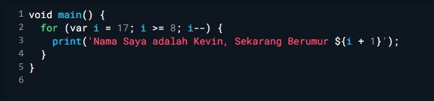

# Laporan Praktikum 02 : Pemrograman Dasar Dart Bagian 1

nama      : Kevin Marsha Hafish Andrika  
NIM       : 244107060077  
Absen     : 10  

 
<b>SOAL 1</b>  
Modifikasilah kode pada baris 3 di VS Code atau Editor Code favorit Anda berikut ini agar mendapatkan keluaran (output) sesuai yang diminta!
 
 
 
Output yang diminta (Gantilah Fulan dengan nama Anda):
 
 
 
Jawaban soal no 1  
kode yang telah di modifikasi 
 
 
hasil yang di tampilkan adalah 

 
 
Soal 2
Mengapa sangat penting untuk memahami bahasa pemrograman Dart sebelum kita menggunakan framework Flutter ? Jelaskan!

Soal 3
Rangkumlah materi dari codelab ini menjadi poin-poin penting yang dapat Anda gunakan untuk membantu proses pengembangan aplikasi mobile menggunakan framework Flutter.

Soal 4
Buatlah penjelasan dan contoh eksekusi kode tentang perbedaan Null Safety dan Late variabel !

