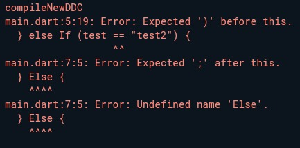
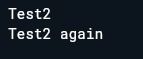
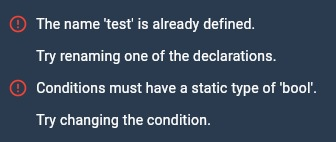
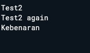
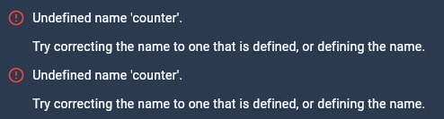
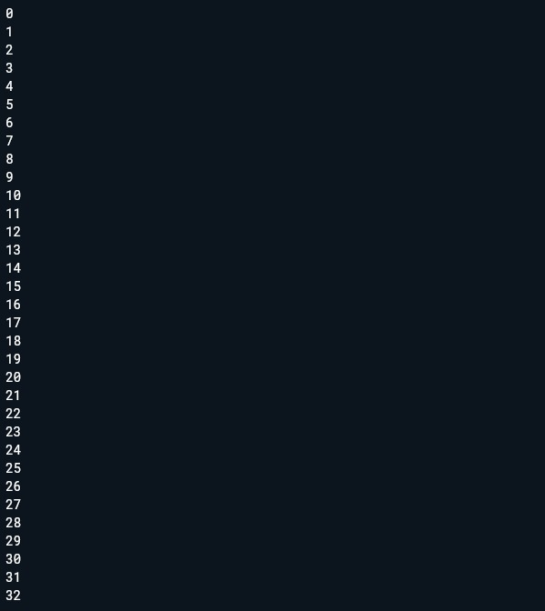
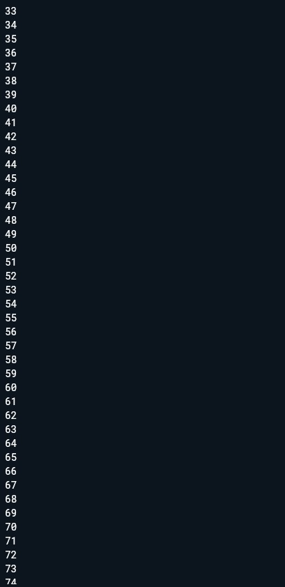

# Laporan Praktikum 03: Pemrograman Dasar Dart Bagian 2

**Nama** : Kevin Marsha Hafish Andrika  
**NIM** : 244107060077  
**Absen**: 10  

---

## SOAL 1
Silakan selesaikan Praktikum 1 sampai 3, lalu dokumentasikan berupa screenshot hasil pekerjaan beserta penjelasannya!

## JAWABAN SOAL 1
 ## PRAKTIKUM 1 : Menerapkan Control Flows (IF/Else)


  **Langkah 1 :**

  Ketik atau salin kode program berikut ke dalam fungsi 'main()'

  ```dart
  void main(){
    String test = "test2";
    if (test == "test1") {
      print("Test1");
    } else If (test == "test2") {
      print("Test2");
    } Else {
      print("Something else");
    }

    if (test == "test2") print("Test2 again");
  }
```
  **Langkah 2 :**
  
  Silakan coba eksekusi (Run) kode pada langkah 1 tersebut. Apa yang terjadi? Jelaskan!

  

  pada langkah 1 penulisan 'if' dan 'else' menggunakan huruf kapital di awal yang akan menyebabkan error 
  dikarenakan DART bersifat 'case-sensitive' maka tidak akan terbaca atau dikenali, untuk penulisan yang benar 
  adalah sebagai berikut :

  ```dart
  void main() {
    String test = "test2";
    if (test == "test1") {
      print("Test1");
    } else if (test == "test2") {
      print("Test2");
    } else {
      print("Something else");
    }

    if (test == "test2") print("Test2 again");
  }
```

  untuk output setelah diperbaiki yaitu :

  

  **Langkah 3:**

  Tambahkan kode program berikut, lalu coba eksekusi (Run) kode Anda.

  ```dart
  String test = "true";
  if (test) {
     print("Kebenaran");
  }
  ```

  Apa yang terjadi ? Jika terjadi error, silakan perbaiki namun tetap menggunakan if/else.

  ketika kode tersebut di jalankan maka yang terjadi adalah error berikut 

  

  berikut kode setelah di perbaiki agar menggunakan 'if' / 'else'

  ```dart
  String test2 = "true";
  if (test2 == "true") {
     print("Kebenaran");
  }
```

  untuk output setelah diperbaiki adalah :

  

 ## PRAKTIKUM 2 : Menerapkan Prulangan 'while' dan 'do while'

  **Langkah 1 :**

  Ketik atau salin kode program berikut ke dalam fungsi main().

  ```dart
  void main() {
    while (counter < 33) {
    print(counter);
    counter++;
    }
  }
  ```

  **Langkah 2 :**

  Silakan coba eksekusi (Run) kode pada langkah 1 tersebut. Apa yang terjadi? Jelaskan! Lalu perbaiki jika terjadi error.

  saat di eksekusi kode mengalami error

  

  error tersebut terjadi karena variabel 'counter' belum dideklarasikan. Dart mengharuskan setiap variabel
  dideklarasikan dengan tipe data atau keyword 'var' sebelum digunakan. Selain itu, variabel 'counter' juga perlu
  diinisialisasi dengan nilai awal agar perulangan 'while' dapat berjalan.

  perbaikan kode yang benar adalah seperti berikut 

  ```dart
   void main() {
    int counter = 0;
    while (counter < 33) {
    print(counter);
    counter++;
    }
  }
  ```

  untuk output setelah di perbaiki adalah seperti berikut 

  

  **Langkah 3 :**

  Tambahkan kode program berikut, lalu coba eksekusi (Run) kode Anda

  ```dart
  do {
    print(counter);
    counter++;
  } while (counter < 77);
```
  apa yang terjadi ? Jika terjadi error, silakan perbaiki namun tetap menggunakan do-while

  kode tersebut melanjutkan perulangan dari 33 hingga 76

  untuk output yang dihasilkan adalah sebagai berikut 

   

