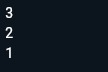
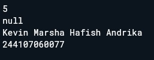
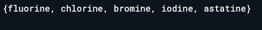
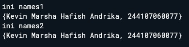
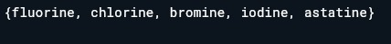
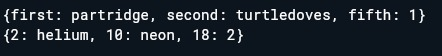
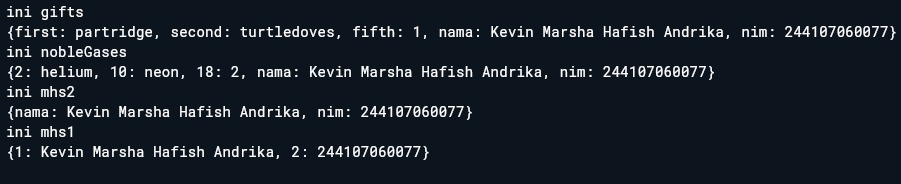
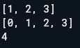
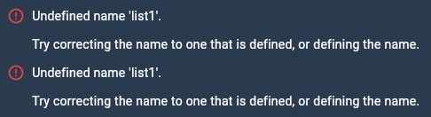
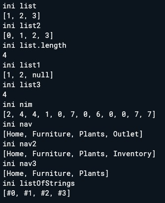

# Laporan Praktikum 04: Pengantar Pemrograman Mobile Bagian 3

**Nama** : Kevin Marsha Hafish Andrika  
**NIM** : 244107060077  
**Absen**: 10  

---

## SOAL 1: Dokumentasi Praktikum

### Praktikum 1: Eksperimen Tipe Data List & Control Flow

### Langkah 1:

  Ketik atau salin kode program berikut ke dalam void main().

  ```dart
  void main(){
  var list = [1, 2, 3];
    assert(list.length == 3);
    assert(list[1] == 2);
      print(list.length);
      print(list[1]);

    list[1] = 1;
    assert(list[1] == 1);
      print(list[1]);
  }
  ```

### Langkah 2:

Silakan coba eksekusi (Run) kode pada langkah 1 tersebut. Apa yang terjadi? Jelaskan!

kode ketika di jalankan pada darpad maka akan mengeluarkan output seperti berikut 



yang terjadi pada kode tersebut yaitu 

* *var list = [1, 2, 3];*
  Membuat sebuah objek List berisi tiga angka. Di dalam memori, index dimulai dari 0. Jadi: index 0 adalah 1, index 1 adalah 2, dan index 2 adalah 3.

* *assert(list.length == 3); dan assert(list[1] == 2);*
  Fungsi assert digunakan untuk mengecek kebenaran sebuah kondisi saat tahap development. Karena panjang list memang 3 dan isi index ke-1 memang 2, kode terus berjalan tanpa error.

* *print(list.length); dan print(list[1]);*
  Mencetak panjang list (3) dan nilai di posisi kedua (2).

* *list[1] = 1;*
  Melakukan perubahan data (mutation). Nilai pada index ke-1 yang tadinya 2 sekarang diganti menjadi 1.

* *print(list[1]);*
  Mencetak nilai baru setelah diubah, yaitu 1.

### Langkah 3:

Ubah kode pada langkah 1 menjadi variabel final yang mempunyai index = 5 dengan default value = null. Isilah nama dan NIM Anda pada elemen index ke-1 dan ke-2. Lalu print dan capture hasilnya.

Apa yang terjadi ? Jika terjadi error, silakan perbaiki.

kode yang telah di ubah 
```dart
  void main(){
  final list = List.filled(5, null);
    assert(list.length == 3);
    assert(list[1] == 2);
      print(list.length);
      print(list[1]);

    list[1] = 'Kevin Marsha Hafish Andrika';
    list[2] = '244107060077';
    assert(list[1] == 1);
      print(list[1]);
  }
```

kode tersebut mengalami error seperti ini 


Hal ini terjadi karena List.filled(5, null) tanpa tipe eksplisit menyebabkan Dart menginferensi tipe list menjadi List<Null>. Akibatnya, elemen-elemen dalam list hanya dapat menyimpan nilai null, sehingga ketika mencoba mengisinya dengan String, Dart langsung menolaknya dan terjadi error.

untuk kode yang telah di perbaiki yaitu 
```dart
  void main(){
  final List<String?> list = List.filled(5, null);
    assert(list.length == 5);
    assert(list[1] == null);
      print(list.length);
      print(list[1]);

    list[1] = 'Kevin Marsha Hafish Andrika';
    list[2] = '244107060077';
    assert(list[1] == 'Kevin Marsha Hafish Andrika');
    assert(list[2] == '244107060077');
      print(list[1]);
      print(list[2]);
  }
```

*List<String?>* digunakan jika semua elemen pasti bertipe String atau null.
*List<Object?>* adalah alternatif jika elemen bisa bertipe apa saja (int, String, dll.) atau null. Object adalah tipe dasar semua objek di Dart.

untuk output yang dihasilkan adalah sebagai berikut 



## Praktikum 2: Eksperimen Tipe Data Set

  ### Langkah 1 

  Ketik atau salin kode program berikut ke dalam fungsi main().
  ```dart
  void main(){
    var halogens = {'fluorine', 'chlorine', 'bromine', 'iodine', 'astatine'};
  print(halogens);
  }
  ```

  ### Langkah 2

  Silakan coba eksekusi (Run) kode pada langkah 1 tersebut. Apa yang terjadi? Jelaskan! Lalu perbaiki jika terjadi error.

  ketika kode tersebut di run maka akan muncul output seperti berikut 

  

  ### Langkah 3

  Tambahkan kode program berikut, lalu coba eksekusi (Run) kode Anda.
  ```dart
    var names1 = <String>{};
    Set<String> names2 = {}; // This works, too.
    var names3 = {}; // Creates a map, not a set.

    print(names1);
    print(names2);
    print(names3);
  ```
  Apa yang terjadi ? Jika terjadi error, silakan perbaiki namun tetap menggunakan ketiga variabel tersebut. Tambahkan elemen nama dan NIM Anda pada kedua variabel Set tersebut dengan dua fungsi berbeda yaitu .add() dan .addAll(). Untuk variabel Map dihapus, nanti kita coba di praktikum selanjutnya.

  Kode awal berjalan tanpa error, namun terdapat perbedaan pada ketiga variabel tersebut:

  * var names1 = <String>{}; — Membuat Set kosong bertipe Set<String> menggunakan sintaks type annotation eksplisit <String>.
  * Set<String> names2 = {}; — Cara lain membuat Set kosong bertipe Set<String> dengan deklarasi tipe pada variabelnya.
  * var names3 = {}; — Ini bukan Set, melainkan Map kosong (Map<dynamic, dynamic>). Karena tidak ada type annotation, Dart menginferensi {} kosong sebagai Map.
  * Pada instruksi, names3 (Map) dihapus. Elemen nama dan NIM ditambahkan ke names1 menggunakan .add() dan ke names2 menggunakan .addAll():

  untuk kode setelah di perbaiki yaitu 
  ```dart
    void main(){
    var names1 = <String>{};
      Set<String> names2 = {};
    
      names1.add ('Kevin Marsha Hafish Andrika');
      names1.add ('244107060077');
    
      names2.addAll (['Kevin Marsha Hafish Andrika', '244107060077']);
    
      print ('ini names1');
      print (names1);
      print ('ini names2');
      print (names2);
    }
  ```

  untuk output yang akan di tampilkan yaitu 
  

## Praktikum 3: Ekperimen Tipe Data Maps

  ### Langkah 1
  Ketik atau salin kode program berikut ke dalam fungsi main()
  ```dart
    void main() {
        var gifts = {
        // Key:    Value
        'first': 'partridge',
        'second': 'turtledoves',
        'fifth': 1
      };

      var nobleGases = {
        2: 'helium',
        10: 'neon',
        18: 2,
      };

      print(gifts);
      print(nobleGases);
    }
  ```

  ### Langkah 2
  
  Silakan coba eksekusi (Run) kode pada langkah 1 tersebut. Apa yang terjadi? Jelaskan! Lalu perbaiki jika terjadi error.

  untuk output yang di tampilkan yaitu 

  

  * gifts: Menggunakan String sebagai kunci (Key).

    * Kunci 'first' berpasangan dengan nilai 'partridge'.

    * Kunci 'fifth' berpasangan dengan angka 1.

  * nobleGases: Menggunakan Integer (angka) sebagai kunci (Key).

    * Angka 2 berpasangan dengan 'helium'.

    * Angka 18 berpasangan dengan angka 2.

  * Tipe Data Campuran (Dynamic):

    Perhatikan pada gifts, nilainya bisa berupa tulisan ('partridge') dan juga angka (1). Dart secara otomatis mendeteksi bahwa Map ini memiliki nilai yang bersifat fleksibel atau Object/Dynamic.

  * Key Tidak Harus String:
  
    Pada nobleGases, Anda membuktikan bahwa Key tidak selalu harus teks. Anda bisa menggunakan angka (seperti nomor atom) untuk memanggil datanya nanti.

  * Sintaks Literal:

    Tanda kurung kurawal { } adalah cara tercepat (disebut map literal) untuk membuat Map di Dart.

  ### Langkah 3

  Tambahkan kode program berikut, lalu coba eksekusi (Run) kode Anda.
  ```dart
    var mhs1 = Map<String, String>();
    gifts['first'] = 'partridge';
    gifts['second'] = 'turtledoves';
    gifts['fifth'] = 'golden rings';

    var mhs2 = Map<int, String>();
    nobleGases[2] = 'helium';
    nobleGases[10] = 'neon';
    nobleGases[18] = 'argon';
  ```

  Apa yang terjadi ? Jika terjadi error, silakan perbaiki.

  Tambahkan elemen nama dan NIM Anda pada tiap variabel di atas (gifts, nobleGases, mhs1, dan mhs2). Dokumentasikan hasilnya dan buat laporannya!

  Kode berjalan tanpa error. Mengganti value gifts['fifth'] dari 1 (int) menjadi 'golden rings' (String), dan nobleGases[18] dari 2 (int) menjadi 'argon' (String). Karena tipe Map-nya sudah Map<String, Object> dan Map<int, Object> (diinferensi dari Langkah 1), assignment String ke value tetap berhasil dan valid.

  mhs1 dan mhs2 dideklarasikan menggunakan konstruktor Map<K, V>(), ini merupakan cara alternatif membuat Map selain secara literal. Tipe key dan value-nya sudah ditentukan secara eksplisit, sehingga lebih aman dibanding Map yang tipenya diinferensi otomatis dari literal campuran.

  untuk kode yang sudah di perbaiki yaitu 
  ```dart
      void main() {
        var gifts = {
        // Key:    Value
        'first': 'partridge',
        'second': 'turtledoves',
        'fifth': 1,
        'nama': 'Kevin Marsha Hafish Andrika',
        'nim': '244107060077'
      };

      var nobleGases = {
        2: 'helium',
        10: 'neon',
        18: 2,
        'nama': 'Kevin Marsha Hafish Andrika',
        'nim': '244107060077'
      };
      
      var mhs1 = Map<String, String>();
        mhs1['nama'] = 'Kevin Marsha Hafish Andrika';
        mhs1['nim'] = '244107060077';

      var mhs2 = Map<int, String>();
        mhs2[1] = 'Kevin Marsha Hafish Andrika';
        mhs2[2] = '244107060077';
      
      print ('ini gifts');
      print(gifts);
      print ('ini nobleGases');
      print(nobleGases);
      print ('ini mhs2');
      print(mhs1);
      print ('ini mhs1');
      print(mhs2);
      
    }
  ```

  untuk output yang di hasilkan yaitu 
  

## Praktikum 4: Eksperimen Tipe Data List: Spread dan Control-flow Operators

  ### Langkah 1

  Ketik atau salin kode program berikut ke dalam fungsi main().
  ``` dart
  void main(){
    var list = [1, 2, 3];
    var list2 = [0, ...list];
    print(list1);
    print(list2);
    print(list2.length);
  }
  ```

  ### Langkah 2

  Silakan coba eksekusi (Run) kode pada langkah 1 tersebut. Apa yang terjadi? Jelaskan! Lalu perbaiki jika terjadi error.

  pada saat kode tersebut di run maka akan muncul error yaitu 

  

  error tersebut terjadi dikarenakan list1 tidak ada dan belum di definisikan Selain itu, pada syntax [0, ...list] menggunakan Spread Operator (...). Operator ini "membuka" isi list dan memasukkan semua elemennya ke dalam list baru secara berurutan. Jadi [0, ...list] hasilnya adalah [0, 1, 2, 3], bukan nested list.

  kode setelah di perbaiki yaitu 
  ```dart
  void main(){
    var list = [1, 2, 3];
    var list2 = [0, ...list];
    print(list);
    print(list2);
    print(list2.length);
  }
  ```

  untuk output yang di tampilkan setelah kode di perbaiki yaitu

  

  ### Langkah 3

  Tambahkan kode program berikut, lalu coba eksekusi (Run) kode Anda.
  ```dart
    list1 = [1, 2, null];
    print(list1);
    var list3 = [0, ...?list1];
    print(list3.length);
  ```

  Apa yang terjadi ? Jika terjadi error, silakan perbaiki.

  Tambahkan variabel list berisi NIM Anda menggunakan Spread Operators. Dokumentasikan hasilnya dan buat laporannya!

  Kode tersebut punya dua masalah.

  1. Variabel list bernama list1 tidak terdefinisi sama seperti sebelumnya, harusnya list.
  2. Jika kita assign [1, 2, null] ke variabel list yang sudah ada (bertipe List<int>), Dart akan error karena null tidak bisa masuk ke List<int>.

  Solusinya adalah ubah tipe variabelnya menjadi List<int?> atau mendeklarasikan variabel list1.

  

  untuk kode yang sudah di perbaiki yaitu 
  ```dart
  void main(){
    var list = [1, 2, 3];
    var list2 = [0, ...list];
    print('ini list');
    print(list);
    print('ini list2');
    print(list2);
    print('ini list.length');
    print(list2.length);
    
    var list1 = [1, 2, null];
    print('ini list1');
    print(list1);
    var list3 = [0, ...?list1];
    print('ini list3');
    print(list3.length);
    
    var charNIM = [2, 4, 4, 1, 0, 7, 0, 6, 0, 0, 7, 7];
    var nim = [...charNIM];
    print('ini nim');
    print (nim);
  }
  ```

  untuk output yang di tampilkan yaitu 

  

  ### Langkah 4 

  Tambahkan kode program berikut, lalu coba eksekusi (Run) kode Anda.
  ```dart
    var nav = ['Home', 'Furniture', 'Plants', if (promoActive) 'Outlet'];
    print(nav);
  ```

  Apa yang terjadi ? Jika terjadi error, silakan perbaiki. Tunjukkan hasilnya jika variabel promoActive ketika true dan false.

  ketika kode di jalankan maka akan muncul error yaitu

  

  error tersebut terjadi karena promoActive belum di deklarasikan 

  untuk kode setelah di perbaiki yaitu 
  ```dart
  void main(){
    var list = [1, 2, 3];
    var list2 = [0, ...list];
    print('ini list');
    print(list);
    print('ini list2');
    print(list2);
    print('ini list.length');
    print(list2.length);
    
    var list1 = [1, 2, null];
    print('ini list1');
    print(list1);
    var list3 = [0, ...?list1];
    print('ini list3');
    print(list3.length);
    
    var charNIM = [2, 4, 4, 1, 0, 7, 0, 6, 0, 0, 7, 7];
    var nim = [...charNIM];
    print('ini nim');
    print (nim);
    
    bool promoActive = true;
    var nav = ['Home', 'Furniture', 'Plants', if (promoActive) 'Outlet'];
    print ('ini nav');
    print(nav);
  }
  ```

  untuk output yang di tampilkan yaitu 

  ketika true

  

  ketika false

  

  ### Langkah 5

  Tambahkan kode program berikut, lalu coba eksekusi (Run) kode Anda.
  ```dart
    var nav2 = ['Home', 'Furniture', 'Plants', if (login case 'Manager') 'Inventory'];
    print(nav2);
  ```

  Apa yang terjadi ? Jika terjadi error, silakan perbaiki. Tunjukkan hasilnya jika variabel login mempunyai kondisi lain.

  ketika kode tersebut di tambahkan dan di jalankan maka akan terjadi error 

  

  error tersebut terjadi di karenakan login belum di deklarasikan 

  untuk kode setelah di perbaiki yaitu 
  ```dart
  void main(){
    
    var list = [1, 2, 3];
    var list2 = [0, ...list];
    print('ini list');
    print(list);
    print('ini list2');
    print(list2);
    print('ini list.length');
    print(list2.length);
    
    var list1 = [1, 2, null];
    print('ini list1');
    print(list1);
    var list3 = [0, ...?list1];
    print('ini list3');
    print(list3.length);
    
    var charNIM = [2, 4, 4, 1, 0, 7, 0, 6, 0, 0, 7, 7];
    var nim = [...charNIM];
    print('ini nim');
    print (nim);
    
    bool promoActive = true;
    var nav = ['Home', 'Furniture', 'Plants', if (promoActive) 'Outlet'];
    print ('ini nav');
    print(nav);
    
    String login = 'Manager';
    var nav2 = ['Home', 'Furniture', 'Plants', if (login case 'Manager') 'Inventory'];
    print('ini nav2');
    print(nav2);
    
    login = 'staff';
    var nav3 = ['Home', 'Furniture', 'Plants', if (login case 'Manager') 'Inventory'];
    print('ini nav3');
    print(nav3);
  }
  ```

  untuk output yang di tampilkan yaitu
  
  

  ### Langkah 6

  Tambahkan kode program berikut, lalu coba eksekusi (Run) kode Anda.
  ```dart
    var listOfInts = [1, 2, 3];
    var listOfStrings = ['#0', for (var i in listOfInts) '#$i'];
    assert(listOfStrings[1] == '#1');
    print(listOfStrings);
  ```

  untuk output yang di tampilkan yaitu 
  
  

  Kode ini berjalan baik tanpa error. Fitur yang digunakan adalah Collection For,dimana kita bisa mengisi elemen list secara otomatis menggunakan perulangan for langsung di dalam literal list.

  Manfaat Collection for sangat berguna ketika ingin membuat list baru berdasarkan elemen dari list lain, tanpa perlu menulis loop terpisah di luar.

  Pada contoh ini, for (var i in listOfInts) '#$i' akan menghasilkan '#1', '#2', '#3' secara berurutan, lalu digabungkan dengan elemen pertama '#0', sehingga hasilnya adalah ['#0', '#1', '#2', '#3'].

  Fungsi assert(listOfStrings[1] == '#1') pada kode tersebut bertugas memverifikasi bahwa elemen di indeks ke-1 dari listOfStrings bernilai '#1'. Kalau kondisi ini tidak terpenuhi, program akan melempar AssertionError di mode debug. Karena Collection For menghasilkan elemen secara berurutan mulai dari '#1', kondisi ini benar dan program berjalan normal.

## Praktikum 5: Eksperimen Tipe Data Records

  ### Langkah 1

  Ketik atau salin kode program berikut ke dalam fungsi main().
  ```dart
    void main(){
      var record = ('first', a: 2, b: true, 'last');
      print(record)
    }
  ```
  ### Langkah 2

  Silakan coba eksekusi (Run) kode pada langkah 1 tersebut. Apa yang terjadi? Jelaskan! Lalu perbaiki jika terjadi error.

  ketika kode tersebut di jalankan maka akan muncul