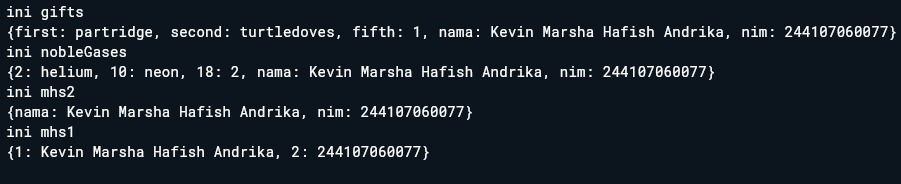
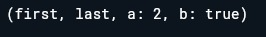
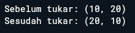
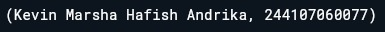
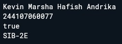
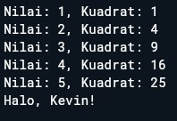
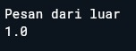
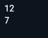

# Laporan Praktikum 04: Pengantar Pemrograman Mobile Bagian 3

**Nama** : Kevin Marsha Hafish Andrika  
**NIM** : 244107060077  
**Absen**: 10  

---

## SOAL 1: Dokumentasi Praktikum

### Praktikum 1: Eksperimen Tipe Data List & Control Flow

### Langkah 1:

  Ketik atau salin kode program berikut ke dalam void main().

  ```dart
  void main(){
  var list = [1, 2, 3];
    assert(list.length == 3);
    assert(list[1] == 2);
      print(list.length);
      print(list[1]);

    list[1] = 1;
    assert(list[1] == 1);
      print(list[1]);
  }
  ```

### Langkah 2:

Silakan coba eksekusi (Run) kode pada langkah 1 tersebut. Apa yang terjadi? Jelaskan!

kode ketika di jalankan pada darpad maka akan mengeluarkan output seperti berikut 


yang terjadi pada kode tersebut yaitu 

* *var list = [1, 2, 3];*
  Membuat sebuah objek List berisi tiga angka. Di dalam memori, index dimulai dari 0. Jadi: index 0 adalah 1, index 1 adalah 2, dan index 2 adalah 3.

* *assert(list.length == 3); dan assert(list[1] == 2);*
  Fungsi assert digunakan untuk mengecek kebenaran sebuah kondisi saat tahap development. Karena panjang list memang 3 dan isi index ke-1 memang 2, kode terus berjalan tanpa error.

* *print(list.length); dan print(list[1]);*
  Mencetak panjang list (3) dan nilai di posisi kedua (2).

* *list[1] = 1;*
  Melakukan perubahan data (mutation). Nilai pada index ke-1 yang tadinya 2 sekarang diganti menjadi 1.

* *print(list[1]);*
  Mencetak nilai baru setelah diubah, yaitu 1.

### Langkah 3:

Ubah kode pada langkah 1 menjadi variabel final yang mempunyai index = 5 dengan default value = null. Isilah nama dan NIM Anda pada elemen index ke-1 dan ke-2. Lalu print dan capture hasilnya.

Apa yang terjadi ? Jika terjadi error, silakan perbaiki.

kode yang telah di ubah 
```dart
  void main(){
  final list = List.filled(5, null);
    assert(list.length == 3);
    assert(list[1] == 2);
      print(list.length);
      print(list[1]);

    list[1] = 'Kevin Marsha Hafish Andrika';
    list[2] = '244107060077';
    assert(list[1] == 1);
      print(list[1]);
  }
```

kode tersebut mengalami error seperti ini 


Hal ini terjadi karena List.filled(5, null) tanpa tipe eksplisit menyebabkan Dart menginferensi tipe list menjadi List<Null>. Akibatnya, elemen-elemen dalam list hanya dapat menyimpan nilai null, sehingga ketika mencoba mengisinya dengan String, Dart langsung menolaknya dan terjadi error.

untuk kode yang telah di perbaiki yaitu 
```dart
  void main(){
  final List<String?> list = List.filled(5, null);
    assert(list.length == 5);
    assert(list[1] == null);
      print(list.length);
      print(list[1]);

    list[1] = 'Kevin Marsha Hafish Andrika';
    list[2] = '244107060077';
    assert(list[1] == 'Kevin Marsha Hafish Andrika');
    assert(list[2] == '244107060077');
      print(list[1]);
      print(list[2]);
  }
```

*List<String?>* digunakan jika semua elemen pasti bertipe String atau null.
*List<Object?>* adalah alternatif jika elemen bisa bertipe apa saja (int, String, dll.) atau null. Object adalah tipe dasar semua objek di Dart.

untuk output yang dihasilkan adalah sebagai berikut 


## Praktikum 2: Eksperimen Tipe Data Set

  ### Langkah 1 

  Ketik atau salin kode program berikut ke dalam fungsi main().
  ```dart
  void main(){
    var halogens = {'fluorine', 'chlorine', 'bromine', 'iodine', 'astatine'};
  print(halogens);
  }
  ```

  ### Langkah 2

  Silakan coba eksekusi (Run) kode pada langkah 1 tersebut. Apa yang terjadi? Jelaskan! Lalu perbaiki jika terjadi error.

  ketika kode tersebut di run maka akan muncul output seperti berikut 

  

  ### Langkah 3

  Tambahkan kode program berikut, lalu coba eksekusi (Run) kode Anda.
  ```dart
    var names1 = <String>{};
    Set<String> names2 = {}; // This works, too.
    var names3 = {}; // Creates a map, not a set.

    print(names1);
    print(names2);
    print(names3);
  ```
  Apa yang terjadi ? Jika terjadi error, silakan perbaiki namun tetap menggunakan ketiga variabel tersebut. Tambahkan elemen nama dan NIM Anda pada kedua variabel Set tersebut dengan dua fungsi berbeda yaitu .add() dan .addAll(). Untuk variabel Map dihapus, nanti kita coba di praktikum selanjutnya.

  Kode awal berjalan tanpa error, namun terdapat perbedaan pada ketiga variabel tersebut:

  * var names1 = <String>{}; — Membuat Set kosong bertipe Set<String> menggunakan sintaks type annotation eksplisit <String>.
  * Set<String> names2 = {}; — Cara lain membuat Set kosong bertipe Set<String> dengan deklarasi tipe pada variabelnya.
  * var names3 = {}; — Ini bukan Set, melainkan Map kosong (Map<dynamic, dynamic>). Karena tidak ada type annotation, Dart menginferensi {} kosong sebagai Map.
  * Pada instruksi, names3 (Map) dihapus. Elemen nama dan NIM ditambahkan ke names1 menggunakan .add() dan ke names2 menggunakan .addAll():

  untuk kode setelah di perbaiki yaitu 
  ```dart
    void main(){
    var names1 = <String>{};
      Set<String> names2 = {};
    
      names1.add ('Kevin Marsha Hafish Andrika');
      names1.add ('244107060077');
    
      names2.addAll (['Kevin Marsha Hafish Andrika', '244107060077']);
    
      print ('ini names1');
      print (names1);
      print ('ini names2');
      print (names2);
    }
  ```

  untuk output yang akan di tampilkan yaitu 
  
  

## Praktikum 3: Ekperimen Tipe Data Maps

  ### Langkah 1
  Ketik atau salin kode program berikut ke dalam fungsi main()
  ```dart
    void main() {
        var gifts = {
        // Key:    Value
        'first': 'partridge',
        'second': 'turtledoves',
        'fifth': 1
      };

      var nobleGases = {
        2: 'helium',
        10: 'neon',
        18: 2,
      };

      print(gifts);
      print(nobleGases);
    }
  ```

  ### Langkah 2
  
  Silakan coba eksekusi (Run) kode pada langkah 1 tersebut. Apa yang terjadi? Jelaskan! Lalu perbaiki jika terjadi error.

  untuk output yang di tampilkan yaitu 

  

  * gifts: Menggunakan String sebagai kunci (Key).

    * Kunci 'first' berpasangan dengan nilai 'partridge'.

    * Kunci 'fifth' berpasangan dengan angka 1.

  * nobleGases: Menggunakan Integer (angka) sebagai kunci (Key).

    * Angka 2 berpasangan dengan 'helium'.

    * Angka 18 berpasangan dengan angka 2.

  * Tipe Data Campuran (Dynamic):

    Perhatikan pada gifts, nilainya bisa berupa tulisan ('partridge') dan juga angka (1). Dart secara otomatis mendeteksi bahwa Map ini memiliki nilai yang bersifat fleksibel atau Object/Dynamic.

  * Key Tidak Harus String:
  
    Pada nobleGases, Anda membuktikan bahwa Key tidak selalu harus teks. Anda bisa menggunakan angka (seperti nomor atom) untuk memanggil datanya nanti.

  * Sintaks Literal:

    Tanda kurung kurawal { } adalah cara tercepat (disebut map literal) untuk membuat Map di Dart.

  ### Langkah 3

  Tambahkan kode program berikut, lalu coba eksekusi (Run) kode Anda.
  ```dart
    var mhs1 = Map<String, String>();
    gifts['first'] = 'partridge';
    gifts['second'] = 'turtledoves';
    gifts['fifth'] = 'golden rings';

    var mhs2 = Map<int, String>();
    nobleGases[2] = 'helium';
    nobleGases[10] = 'neon';
    nobleGases[18] = 'argon';
  ```

  Apa yang terjadi ? Jika terjadi error, silakan perbaiki.

  Tambahkan elemen nama dan NIM Anda pada tiap variabel di atas (gifts, nobleGases, mhs1, dan mhs2). Dokumentasikan hasilnya dan buat laporannya!

  Kode berjalan tanpa error. Mengganti value gifts['fifth'] dari 1 (int) menjadi 'golden rings' (String), dan nobleGases[18] dari 2 (int) menjadi 'argon' (String). Karena tipe Map-nya sudah Map<String, Object> dan Map<int, Object> (diinferensi dari Langkah 1), assignment String ke value tetap berhasil dan valid.

  mhs1 dan mhs2 dideklarasikan menggunakan konstruktor Map<K, V>(), ini merupakan cara alternatif membuat Map selain secara literal. Tipe key dan value-nya sudah ditentukan secara eksplisit, sehingga lebih aman dibanding Map yang tipenya diinferensi otomatis dari literal campuran.

  untuk kode yang sudah di perbaiki yaitu 
  ```dart
      void main() {
        var gifts = {
        // Key:    Value
        'first': 'partridge',
        'second': 'turtledoves',
        'fifth': 1,
        'nama': 'Kevin Marsha Hafish Andrika',
        'nim': '244107060077'
      };

      var nobleGases = {
        2: 'helium',
        10: 'neon',
        18: 2,
        'nama': 'Kevin Marsha Hafish Andrika',
        'nim': '244107060077'
      };
      
      var mhs1 = Map<String, String>();
        mhs1['nama'] = 'Kevin Marsha Hafish Andrika';
        mhs1['nim'] = '244107060077';

      var mhs2 = Map<int, String>();
        mhs2[1] = 'Kevin Marsha Hafish Andrika';
        mhs2[2] = '244107060077';
      
      print ('ini gifts');
      print(gifts);
      print ('ini nobleGases');
      print(nobleGases);
      print ('ini mhs2');
      print(mhs1);
      print ('ini mhs1');
      print(mhs2);
      
    }
  ```

  untuk output yang di hasilkan yaitu 

  

## Praktikum 4: Eksperimen Tipe Data List: Spread dan Control-flow Operators

  ### Langkah 1

  Ketik atau salin kode program berikut ke dalam fungsi main().
  ``` dart
  void main(){
    var list = [1, 2, 3];
    var list2 = [0, ...list];
    print(list1);
    print(list2);
    print(list2.length);
  }
  ```

  ### Langkah 2

  Silakan coba eksekusi (Run) kode pada langkah 1 tersebut. Apa yang terjadi? Jelaskan! Lalu perbaiki jika terjadi error.

  pada saat kode tersebut di run maka akan muncul error yaitu 

  

  error tersebut terjadi dikarenakan list1 tidak ada dan belum di definisikan Selain itu, pada syntax [0, ...list] menggunakan Spread Operator (...). Operator ini "membuka" isi list dan memasukkan semua elemennya ke dalam list baru secara berurutan. Jadi [0, ...list] hasilnya adalah [0, 1, 2, 3], bukan nested list.

  kode setelah di perbaiki yaitu 
  ```dart
  void main(){
    var list = [1, 2, 3];
    var list2 = [0, ...list];
    print(list);
    print(list2);
    print(list2.length);
  }
  ```

  untuk output yang di tampilkan setelah kode di perbaiki yaitu

  

  ### Langkah 3

  Tambahkan kode program berikut, lalu coba eksekusi (Run) kode Anda.
  ```dart
    list1 = [1, 2, null];
    print(list1);
    var list3 = [0, ...?list1];
    print(list3.length);
  ```

  Apa yang terjadi ? Jika terjadi error, silakan perbaiki.

  Tambahkan variabel list berisi NIM Anda menggunakan Spread Operators. Dokumentasikan hasilnya dan buat laporannya!

  Kode tersebut punya dua masalah.

  1. Variabel list bernama list1 tidak terdefinisi sama seperti sebelumnya, harusnya list.
  2. Jika kita assign [1, 2, null] ke variabel list yang sudah ada (bertipe List<int>), Dart akan error karena null tidak bisa masuk ke List<int>.

  Solusinya adalah ubah tipe variabelnya menjadi List<int?> atau mendeklarasikan variabel list1.

  

  untuk kode yang sudah di perbaiki yaitu 
  ```dart
  void main(){
    var list = [1, 2, 3];
    var list2 = [0, ...list];
    print('ini list');
    print(list);
    print('ini list2');
    print(list2);
    print('ini list.length');
    print(list2.length);
    
    var list1 = [1, 2, null];
    print('ini list1');
    print(list1);
    var list3 = [0, ...?list1];
    print('ini list3');
    print(list3.length);
    
    var charNIM = [2, 4, 4, 1, 0, 7, 0, 6, 0, 0, 7, 7];
    var nim = [...charNIM];
    print('ini nim');
    print (nim);
  }
  ```

  untuk output yang di tampilkan yaitu 

  

  ### Langkah 4 

  Tambahkan kode program berikut, lalu coba eksekusi (Run) kode Anda.
  ```dart
    var nav = ['Home', 'Furniture', 'Plants', if (promoActive) 'Outlet'];
    print(nav);
  ```

  Apa yang terjadi ? Jika terjadi error, silakan perbaiki. Tunjukkan hasilnya jika variabel promoActive ketika true dan false.

  ketika kode di jalankan maka akan muncul error yaitu

  

  error tersebut terjadi karena promoActive belum di deklarasikan 

  untuk kode setelah di perbaiki yaitu 
  ```dart
  void main(){
    var list = [1, 2, 3];
    var list2 = [0, ...list];
    print('ini list');
    print(list);
    print('ini list2');
    print(list2);
    print('ini list.length');
    print(list2.length);
    
    var list1 = [1, 2, null];
    print('ini list1');
    print(list1);
    var list3 = [0, ...?list1];
    print('ini list3');
    print(list3.length);
    
    var charNIM = [2, 4, 4, 1, 0, 7, 0, 6, 0, 0, 7, 7];
    var nim = [...charNIM];
    print('ini nim');
    print (nim);
    
    bool promoActive = true;
    var nav = ['Home', 'Furniture', 'Plants', if (promoActive) 'Outlet'];
    print ('ini nav');
    print(nav);
  }
  ```

  untuk output yang di tampilkan yaitu 

  ketika true

  

  ketika false

  

  ### Langkah 5

  Tambahkan kode program berikut, lalu coba eksekusi (Run) kode Anda.
  ```dart
    var nav2 = ['Home', 'Furniture', 'Plants', if (login case 'Manager') 'Inventory'];
    print(nav2);
  ```

  Apa yang terjadi ? Jika terjadi error, silakan perbaiki. Tunjukkan hasilnya jika variabel login mempunyai kondisi lain.

  ketika kode tersebut di tambahkan dan di jalankan maka akan terjadi error 

  

  error tersebut terjadi di karenakan login belum di deklarasikan 

  untuk kode setelah di perbaiki yaitu 
  ```dart
  void main(){
    
    var list = [1, 2, 3];
    var list2 = [0, ...list];
    print('ini list');
    print(list);
    print('ini list2');
    print(list2);
    print('ini list.length');
    print(list2.length);
    
    var list1 = [1, 2, null];
    print('ini list1');
    print(list1);
    var list3 = [0, ...?list1];
    print('ini list3');
    print(list3.length);
    
    var charNIM = [2, 4, 4, 1, 0, 7, 0, 6, 0, 0, 7, 7];
    var nim = [...charNIM];
    print('ini nim');
    print (nim);
    
    bool promoActive = true;
    var nav = ['Home', 'Furniture', 'Plants', if (promoActive) 'Outlet'];
    print ('ini nav');
    print(nav);
    
    String login = 'Manager';
    var nav2 = ['Home', 'Furniture', 'Plants', if (login case 'Manager') 'Inventory'];
    print('ini nav2');
    print(nav2);
    
    login = 'staff';
    var nav3 = ['Home', 'Furniture', 'Plants', if (login case 'Manager') 'Inventory'];
    print('ini nav3');
    print(nav3);
  }
  ```

  untuk output yang di tampilkan yaitu
  
  

  ### Langkah 6

  Tambahkan kode program berikut, lalu coba eksekusi (Run) kode Anda.
  ```dart
    var listOfInts = [1, 2, 3];
    var listOfStrings = ['#0', for (var i in listOfInts) '#$i'];
    assert(listOfStrings[1] == '#1');
    print(listOfStrings);
  ```

  untuk output yang di tampilkan yaitu 
  
  

  Kode ini berjalan baik tanpa error. Fitur yang digunakan adalah Collection For,dimana kita bisa mengisi elemen list secara otomatis menggunakan perulangan for langsung di dalam literal list.

  Manfaat Collection for sangat berguna ketika ingin membuat list baru berdasarkan elemen dari list lain, tanpa perlu menulis loop terpisah di luar.

  Pada contoh ini, for (var i in listOfInts) '#$i' akan menghasilkan '#1', '#2', '#3' secara berurutan, lalu digabungkan dengan elemen pertama '#0', sehingga hasilnya adalah ['#0', '#1', '#2', '#3'].

  Fungsi assert(listOfStrings[1] == '#1') pada kode tersebut bertugas memverifikasi bahwa elemen di indeks ke-1 dari listOfStrings bernilai '#1'. Kalau kondisi ini tidak terpenuhi, program akan melempar AssertionError di mode debug. Karena Collection For menghasilkan elemen secara berurutan mulai dari '#1', kondisi ini benar dan program berjalan normal.

## Praktikum 5: Eksperimen Tipe Data Records

  ### Langkah 1

  Ketik atau salin kode program berikut ke dalam fungsi main().
  ```dart
    void main(){
      var record = ('first', a: 2, b: true, 'last');
      print(record)
    }
  ```
  ### Langkah 2

  Silakan coba eksekusi (Run) kode pada langkah 1 tersebut. Apa yang terjadi? Jelaskan! Lalu perbaiki jika terjadi error.

  ketika kode tersebut di jalankan maka akan muncul error
  
  

  Kode ini mengalami error saat kompilasi karena ada semicolon (;) yang hilang di baris print(record). Setelah ditambahkan, kode berjalan normal.

  Record di Dart adalah tipe data yang bisa menyimpan beberapa nilai dengan tipe berbeda secara bersamaan, mirip tuple. Record bisa punya field positional (berurutan tanpa nama) dan field named (dengan nama). Pada contoh ini, 'first' dan 'last' adalah positional fields, sedangkan a: 2 dan b: true adalah named fields.

  Saat di-print, Dart menampilkan named fields setelah semua positional fields, terlepas dari urutan penulisannya di kode. Jadi meskipun a: 2 ditulis di tengah, outputnya tetap menampilkan positional fields lebih dulu.

  untuk kode yang sudah di perbaiki yaitu
  ```dart
    void main(){
      var record = ('first', a: 2, b: true, 'last');
      print(record);
    }
  ```

  untuk output setelah di perbaiki yaitu 

  

  ### Langkah 3

  Tambahkan kode program berikut di luar scope void main(), lalu coba eksekusi (Run) kode Anda.
  ```dart
    (int, int) tukar((int, int) record) {
    var (a, b) = record;
    return (b, a);
  }
  ```
  Apa yang terjadi ? Jika terjadi error, silakan perbaiki. Gunakan fungsi tukar() di dalam main() sehingga tampak jelas proses pertukaran value field di dalam Records.

  Kode ini berjalan tanpa error. Fungsi tukar() menerima sebuah Record bertipe (int, int) dan mengembalikan Record baru dengan posisi elemen yang dibalik menggunakan destructuring — var (a, b) = record artinya kita "membongkar" isi record ke dalam dua variabel terpisah a dan b, lalu dikembalikan dalam urutan terbalik (b, a).

  untuk kode yang sudah di tambahkan yaitu 
  ```dart
    (int, int) tukar((int, int) record) {
    var (a, b) = record;
    return (b, a);
  }

  void main() {
    var before = (10, 20);
    print('Sebelum tukar: $before');
    var after = tukar(before);
    print('Sesudah tukar: $after');
  }
  ```

  untuk outputnya yaitu

  

  ### Langkah 4

  Tambahkan kode program berikut di dalam scope void main(), lalu coba eksekusi (Run) kode Anda.
  ```dart
      //Record type annotation in a variable declaration:
  (String, int) mahasiswa;
  print(mahasiswa);
  ```
  Apa yang terjadi ? Jika terjadi error, silakan perbaiki. Inisialisasi field nama dan NIM Anda pada variabel record mahasiswa di atas. Dokumentasikan hasilnya dan buat laporannya!

  Kode ini error karena variabel mahasiswa dideklarasikan tapi belum diinisialisasi, kemudian langsung di-print.

  

  untuk kode yang sudah di perbaiki yaitu 
  ```dart
    void main() {
    (String, int) mahasiswa;
    mahasiswa = ('Kevin Marsha Hafish Andrika', 244107060077);
    print(mahasiswa);
  }
  ```

  untuk output yang di tampilkan yaitu
  
  

  ### Langkah 5

  Tambahkan kode program berikut di dalam scope void main(), lalu coba eksekusi (Run) kode Anda.
  ```dart
  var mahasiswa2 = ('first', a: 2, b: true, 'last');

  print(mahasiswa2.$1); // Prints 'first'
  print(mahasiswa2.a); // Prints 2
  print(mahasiswa2.b); // Prints true
  print(mahasiswa2.$2); // Prints 'last'
  ```

  Apa yang terjadi ? Jika terjadi error, silakan perbaiki. Gantilah salah satu isi record dengan nama dan NIM Anda, lalu dokumentasikan hasilnya dan buat laporannya!

  Kode ini berjalan tanpa error. Kode digunakan untuk mengakses field di dalam Record:

  * .$1, .$2, dst. untuk mengakses positional fields berdasarkan urutan (index mulai dari 1)
  * .namaField untuk mengakses named fields langsung dengan namanya

  setelah kode di perbaiki 
  ```dart
    void main() {
    var mahasiswa2 = ('Kevin Marsha Hafish Andrika', a: 244107060077, b: true, 'SIB-2E');

    print(mahasiswa2.$1); // nama
    print(mahasiswa2.a);  // NIM
    print(mahasiswa2.b);  // status aktif
    print(mahasiswa2.$2); // kelas
  }
  ```

  untuk output setelah du ubah 

  

  ## SOAL 2 Jelaskan yang dimaksud Functions dalam bahasa Dart!

  Functions dalam Dart adalah blok kode yang dapat diberi nama dan dipanggil ulang sesuai kebutuhan. Dart merupakan bahasa yang object-oriented, sehingga function pun merupakan objek dengan tipe Function. Artinya function bisa disimpan ke variabel, dijadikan argumen, bahkan dikembalikan sebagai nilai dari function lain.

  Secara umum, function di Dart menggunakan sintaks berikut:
  ```dart
  // Deklarasi function dengan tipe return eksplisit
  int tambah(int a, int b) {
    return a + b;
  }

  // Arrow syntax (untuk body satu ekspresi)
  int kali(int a, int b) => a * b;

  void main() {
    print(tambah(3, 4)); // 7
    print(kali(3, 4));   // 12
  }
  ```
  Penulisan tipe return seperti int, String, atau void dianjurkan untuk keterbacaan, meskipun Dart tetap bisa menginferensinya secara otomatis. Jika function tidak mengembalikan nilai apa pun, tipe return-nya adalah void.

  ## SOAL 3 Jelaskan jenis-jenis parameter di Functions beserta contoh sintaksnya!

  Dart mendukung empat jenis parameter, masing-masing dengan peran yang berbeda:

  a. Required Positional Parameter
  
  Parameter wajib yang urutan pemberiannya harus sesuai dengan deklarasinya.
  ```dart
  String sapa(String nama, int umur) {
    return 'Halo, $nama! Umurku $umur tahun.';
  }

  void main() {
    print(sapa('Kevin', 20));
  }
  ```

  b. Optional Positional Parameter
  
  Parameter yang boleh tidak diisi, diapit oleh tanda kurung siku []. Bisa diberi nilai default.
  ```dart
  String sapa(String nama, [String kota = 'Malang']) {
    return '$nama dari $kota';
  }

  void main() {
    print(sapa('Kevin'));
    print(sapa('Kevin', 'Batu'));
  }
  ```

  c. Named Parameter
  
  Parameter yang dipanggil dengan nama, diapit tanda kurung kurawal {}. Secara default bersifat opsional, kecuali ditandai required.
  ```dart
  void info({required String nama, int nim = 0}) {
    print('Nama: $nama, NIM: $nim');
  }

  void main() {
    info(nama: 'Kevin', nim: 244107060077);
    info(nama: 'Kevin');
  }
  ```

  d. Parameter dengan Tipe Function (Callback)
  
  Parameter yang menerima sebuah function lain sebagai argumen, umum digunakan untuk callback.
  ```dart
  void proses(int nilai, int Function(int) operasi) {
    print(operasi(nilai));
  }

  void main() {
    proses(5, (x) => x * x);
  }
  ```

  ## SOAL 4 Jelaskan maksud Functions sebagai first-class objects beserta contoh sintaknya!

  First-class object artinya sebuah entitas bisa diperlakukan layaknya nilai biasa: disimpan ke variabel, dijadikan argumen fungsi, maupun dikembalikan dari fungsi lain. Di Dart, function adalah first-class object karena semua itu bisa dilakukan terhadapnya.

  contoh sintaks
  ```dart
  int kuadrat(int x) => x * x;

  void main() {
    var fn = kuadrat;
    print(fn(4));

    var list = [3, 1, 4, 1, 5];
    list.sort((a, b) => a.compareTo(b));
    print(list);

    Function multiplier(int faktor) {
      return (int x) => x * faktor;
    }

    var kaliTiga = multiplier(3);
    print(kaliTiga(7));
  }
  ```
  untuk output yang di hasilkan 

  

  Konsep ini memungkinkan pola pemrograman yang lebih fleksibel, seperti higher-order functions, callbacks, dan functional programming style yang banyak digunakan dalam Dart modern.

  ## SOAL 5 Apa itu Anonymous Functions? Jelaskan dan berikan contohnya!

  Anonymous Functions (fungsi anonim) adalah function yang tidak memiliki nama. Dalam Dart, bentuk ini sering disebut juga lambda atau closure. Karena tidak punya nama, biasanya langsung digunakan di tempat pembuatannya, misalnya sebagai argumen ke fungsi lain.

  Sintaks umumnya:
  ```dart
    (parameter) {
    // body
  }

  // Atau versi arrow (satu ekspresi)
  (parameter) => ekspresi
  ```
  Contoh penggunaan nyata:
  ```dart
  void main() {
    // Anonymous function sebagai argumen forEach
    var angka = [1, 2, 3, 4, 5];
    angka.forEach((n) {
      print('Nilai: $n, Kuadrat: ${n * n}');
    });

    // Disimpan ke variabel
    var salam = (String nama) => 'Halo, $nama!';
    print(salam('Kevin')); // Halo, Kevin!
}
  ```

  output yang muncul 

  

  Anonymous function sangat praktis saat dibutuhkan logika singkat yang hanya dipakai sekali, sehingga tidak perlu repot membuat function bernama secara tersendiri.

  ## SOAL 6 Jelaskan perbedaan Lexical scope dan Lexical closures! Berikan contohnya!

  Lexical scope
  Di Dart, cakupan variabel ditentukan oleh tata letak kode dan penggunaan kurung kurawal { }. Setiap pasang kurung kurawal baru membuat "level" scope baru.

  Variabel di scope luar bisa diakses oleh scope di dalamnya.

  Variabel di dalam kurung kurawal tidak bisa diakses dari luar.
  ```dart
  void main() {
    var pesan = "Pesan dari luar";

    void cekScope() {
      var versi = "1.0";
      // Fungsi ini bisa akses 'pesan' karena berada di scope induknya
      print(pesan); 
      print(versi);
    }

    cekScope();
    // print(versi); // Error! 'versi' tidak dikenal di luar fungsi cekScope
  }
  ```

  untuk output yang di hasilkan 

  

  Lexical closure
  Closure adalah sebuah objek fungsi yang memiliki akses ke variabel di dalam lexical scope-nya, meskipun fungsi tersebut digunakan di luar scope aslinya.

  Di Dart, fungsi adalah "first-class objects", artinya fungsi bisa disimpan dalam variabel, dipassing sebagai argumen, atau dikembalikan (return) oleh fungsi lain.
  ```dart
    Function buatPenambah(int tambahSaku) {
    // Variabel 'tambahSaku' tertangkap oleh closure di bawah
    return (int i) => tambahSaku + i;
  }

  void main() {
    // buatPenambah(10) mengembalikan sebuah fungsi yang "mengingat" angka 10
    var tambahSepuluh = buatPenambah(10);
    
    // buatPenambah(5) mengembalikan fungsi yang "mengingat" angka 5
    var tambahLima = buatPenambah(5);

    print(tambahSepuluh(2)); // Hasil: 12
    print(tambahLima(2));     // Hasil: 7
  }
  ```

  untuk output yang dihasilkan

  

  
  ## SOAL 7 Jelaskan dengan contoh cara membuat return multiple value di Functions!

  1. Menggunakan Records (Cara Terbaru & Terbaik)

      Mulai dari Dart 3.0, cara paling efisien dan type-safe adalah menggunakan Records. Ini memungkinkan kamu mengembalikan beberapa nilai tanpa perlu membuat kelas baru.

```dart
  // Fungsi mengembalikan Record (String, int)
  (String, int) ambilDataUser() {
    return ("Alex", 25);
  }

  void main() {
    // Destructuring: Langsung pecah nilainya ke variabel baru
    var (nama, umur) = ambilDataUser();
    
    print("Nama: $nama, Umur: $umur");
  }
```
Kelebihan: Sangat cepat, ringan, dan didukung penuh oleh sistem tipe Dart.

2. Menggunakan Named Records
      Jika kamu ingin nilai yang dikembalikan lebih deskriptif (agar tidak tertukar urutannya), kamu bisa menggunakan named fields dalam Record.

```dart
  ({double lat, double lng}) ambilLokasi() {
    return (lat: -7.98, lng: 112.63);
  }

  void main() {
    var lokasi = ambilLokasi();
    print("Latitude: ${lokasi.lat}, Longitude: ${lokasi.lng}");
  }
```
3. Menggunakan List atau Map
      Ini adalah cara "klasik". Kamu membungkus nilai-nilai tersebut ke dalam koleksi.

      List: Cocok jika tipe datanya sama.

      Map: Cocok jika ingin memberi label pada setiap nilai (namun tidak type-safe untuk tipe data campuran).

```dart
  // Menggunakan List
  List<dynamic> getInfo() {
    return ["Laptop", 15000000];
  }

  void main() {
    var info = getInfo();
    String produk = info[0];
    int harga = info[1];
    
    print("$produk harganya $harga");
  }
```
      Catatan: Menggunakan List<dynamic> kurang disarankan karena kamu kehilangan 
      pengecekan tipe data otomatis (Bisa menyebabkan error saat runtime).

4. Menggunakan Class (Data Modeling)
      Jika data yang dikembalikan cukup kompleks dan sering digunakan di banyak tempat, membuat class adalah solusi yang paling rapi dan profesional.

```dart
  class Result {
    final bool isSuccess;
    final String message;

    Result(this.isSuccess, this.message);
  }

  Result login() {
    // Logika login...
    return Result(true, "Login Berhasil");
  }

  void main() {
    var res = login();
    if (res.isSuccess) {
      print(res.message);
    }
  }
```
