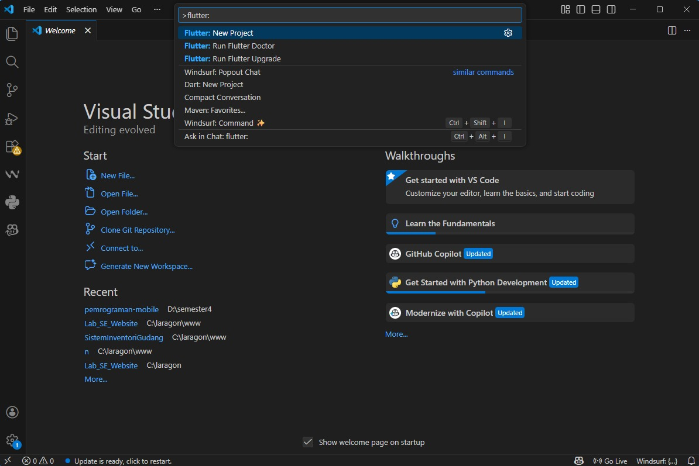
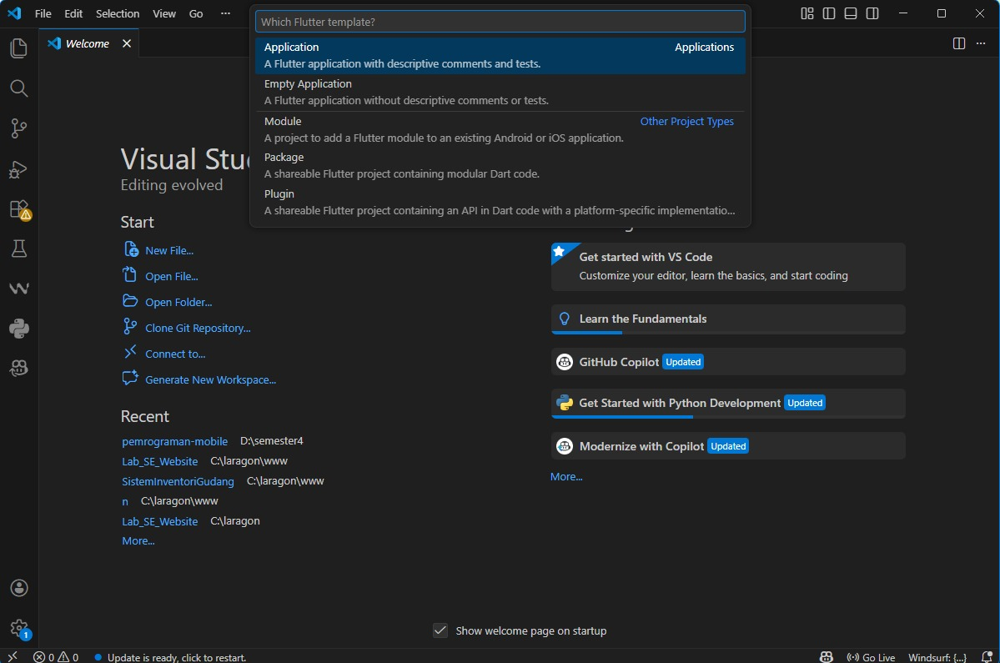
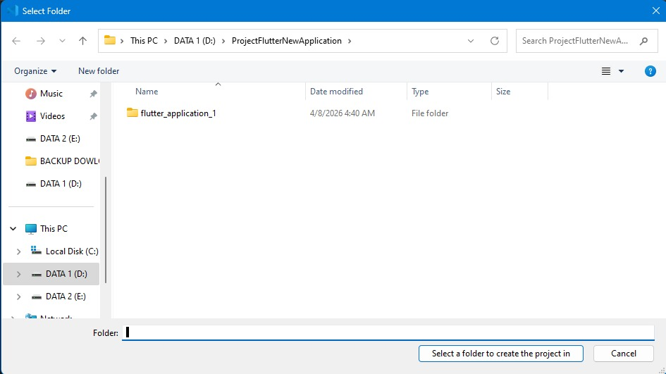
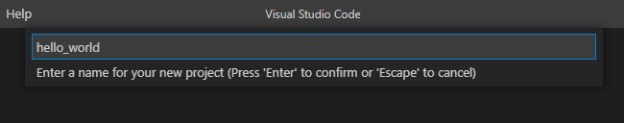
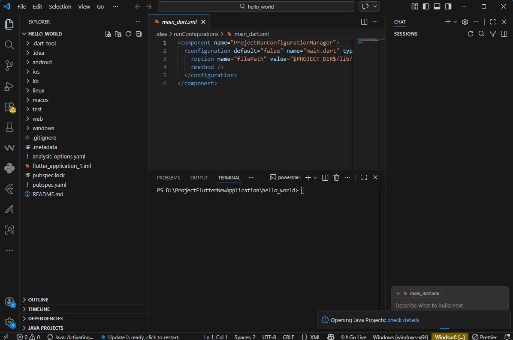

# Laporan Praktikum 04: Pengantar Pemrograman Mobile Bagian 3

**Nama** : Kevin Marsha Hafish Andrika  
**NIM** : 244107060077  
**Absen**: 10  

---

## PRAKTIKUM 1: MEMBUAT PROJECT FLUTTER BARU

## JAWABAN 

### Langkah 1:

Buka VS Code, lalu tekan tombol Ctrl + Shift + P maka akan tampil Command Palette, lalu ketik Flutter. Pilih New Application Project.

Catatan: Anda dapat mengakses Command Palette dengan cara lain, yaitu pilih menu View > Command Palette. Tombol shortcut Ctrl + Shift + P mungkin hanya berlaku di Windows.

### Langkah 2:

Kemudian buat folder sesuai style laporan praktikum yang Anda pilih. Disarankan pada folder dokumen atau desktop atau alamat folder lain yang tidak terlalu dalam atau panjang. Lalu pilih Select a folder to create the project in.

### Langkah 3:

Buat nama project flutter hello_world seperti berikut, lalu tekan Enter. Tunggu hingga proses pembuatan project baru selesai.

Perhatian: Nama project ini harus lowercase (huruf kecil semua) tanpa menggunakan spasi. Untuk memisahkan kata, bisa menggunakan underline (garis bawah). Nama project tidak dapat diawali dengan angka atau karakter khusus lain. Nama project ini bukan nama aplikasi yang akan tampil di Play Store atau App Store. Untuk nama aplikasi, nanti dapat diatur ketika melakukan deployment.

### Langkah 4:

Jika sudah selesai proses pembuatan project baru, pastikan tampilan seperti berikut. Pesan akan tampil berupa "Your Flutter Project is ready!" artinya Anda telah berhasil membuat project Flutter baru.

## PRAKTIKUM 2: MENGHUBUNGKAN PERANGKAT ANDROID ATAU EMULATOR

Melanjutkan dari praktikum 1, Anda diminta untuk menjalankan aplikasi ke perangkat fisik (device Android atau iOS). Silakan ikuti langkah-langkah pada codelab tautan berikut ini.

https://developer.android.com/codelabs/basic-android-kotlin-compose-connect-device?hl=id#0

### Mengaktifkan proses debug USB

Agar Android Studio dapat berkomunikasi dengan perangkat Android, Anda harus mengaktifkan proses debug USB di setelan Opsi developer di perangkat.

Untuk menampilkan opsi developer dan mengaktifkan Proses debug USB:

1. Di perangkat Android, ketuk Settings > About phone.

2. Ketuk Build number tujuh kali.

3. Jika diminta, masukkan sandi atau PIN perangkat. Anda tahu Anda telah berhasil saat melihat pesan You are now a developer!.

4. Kembali ke Settings, lalu ketuk System > Developer options.

5. Jika Anda tidak melihat Developer options, ketuk Advanced options.
6. Ketuk Opsi developer, lalu ketuk tombol Proses debug USB untuk mengaktifkannya.

 

### Menginstal Driver USB Google (khusus Windows)

Jika Android Studio diinstal di Windows, Anda harus menginstal driver perangkat USB agar dapat menjalankan aplikasi di perangkat fisik.

Catatan: Untuk Ubuntu Linux, ikuti petunjuk dalam Menjalankan Aplikasi di Perangkat Hardware.

1. Di Android Studio, klik Tools > SDK Manager. Dialog Preferences > Appearance & Behavior > System Settings > Android SDK akan terbuka.

2. Klik tab SDK Tools.

3. Pilih Google USB Driver, lalu klik OK.

Setelah selesai, file driver akan didownload ke direktori android_sdk\extras\google\usb_driver. Sekarang Anda dapat menghubungkan dan menjalankan aplikasi dari Android Studio.

### Menjalankan aplikasi di perangkat Android menggunakan kabel
Ada dua cara untuk menghubungkan perangkat ke Android Studio, melalui kabel atau Wi-Fi. Anda dapat memilih cara mana pun yang Anda sukai.

Untuk menjalankan aplikasi dari Android Studio di perangkat Android:

1. Sambungkan perangkat Android ke komputer menggunakan kabel USB. Dialog yang meminta Anda mengizinkan proses debug USB akan muncul di perangkat.

2. Pilih kotak centang Always allow from this computer, lalu ketuk OK.
Di Android Studio di komputer, pastikan perangkat Anda dipilih di menu dropdown. Klik Ini adalah ikon Run Android Studio.

3. Pilih perangkat lalu klik OK. Android Studio akan menginstal aplikasi di perangkat, lalu menjalankannya.
Catatan: Untuk Android Studio 3.6 dan versi yang lebih baru, perangkat fisik akan otomatis dipilih saat terhubung dengan proses debug yang aktif.

Jika perangkat menjalankan platform Android yang tidak diinstal di Android Studio dan melihat pesan berisi pertanyaan apakah Anda ingin menginstal platform yang diperlukan, klik Install > Continue > Finish. Android Studio akan menginstal aplikasi di perangkat, lalu menjalankannya.

untuk tampilan output yang dihasilkan yaitu 

### Menjalankan aplikasi di perangkat Android menggunakan Wi-Fi

Jika tidak memiliki kabel, Anda juga dapat menghubungkan dan menjalankan aplikasi di perangkat dengan Wi-Fi.

Memulai

1. Pastikan komputer dan perangkat Anda terhubung ke jaringan nirkabel yang sama.
2. Pastikan perangkat Anda menjalankan Android 11 atau yang lebih baru. Untuk informasi selengkapnya, lihat Memeriksa & mengupdate versi Android.
3. Pastikan komputer Anda telah memiliki Android Studio versi terbaru. Untuk mendownloadnya, lihat Android Studio.
4. Pastikan komputer Anda memiliki SDK Platform Tools versi terbaru.
Menyambungkan perangkat Anda
1. Di Android Studio, pilih Pair Devices Using Wi-Fi dari menu drop-down konfigurasi run.

Dialog Pair devices over Wi-Fi akan terbuka.

2. Buka Developer options, scroll ke bawah ke bagian Debugging, lalu aktifkan Wireless debugging.

3. Pada pop-up Izinkan proses debug nirkabel di jaringan ini?, pilih Allow.

4. Jika Anda ingin menyambungkan perangkat dengan kode QR, pilih Pair device with QR code, lalu pindai kode QR di komputer Anda. Atau, jika Anda ingin menyambungkan perangkat dengan kode penghubung, pilih Pair device with pairing code, lalu masukkan 6 digit kode.
5. Klik jalankan dan Anda dapat men-deploy aplikasi ke perangkat.
