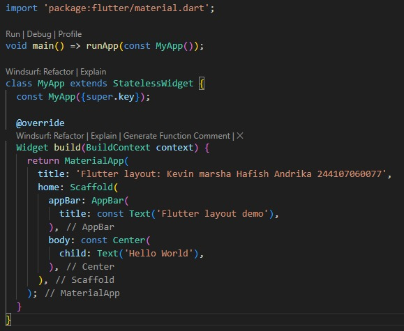
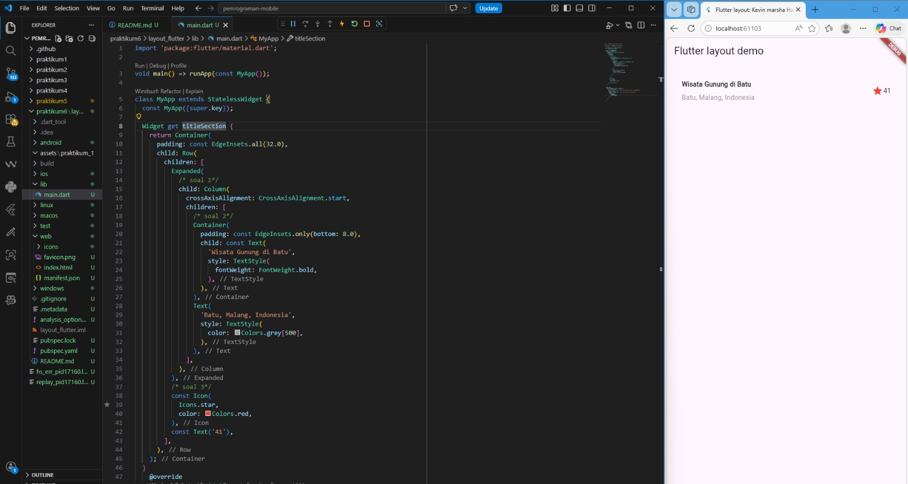
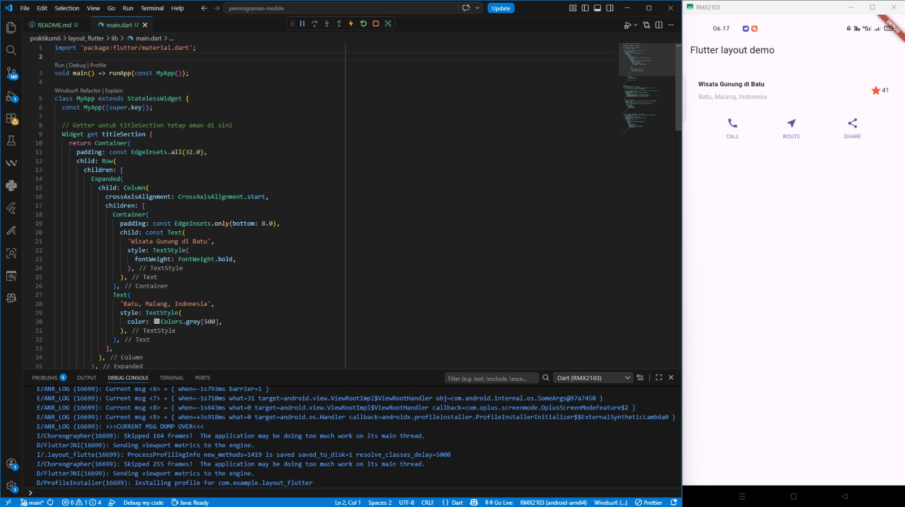
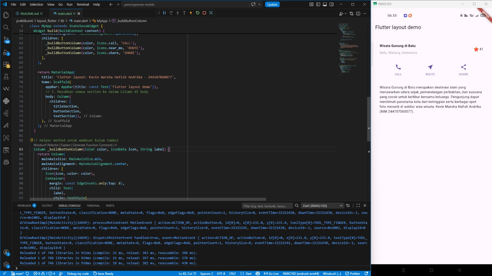
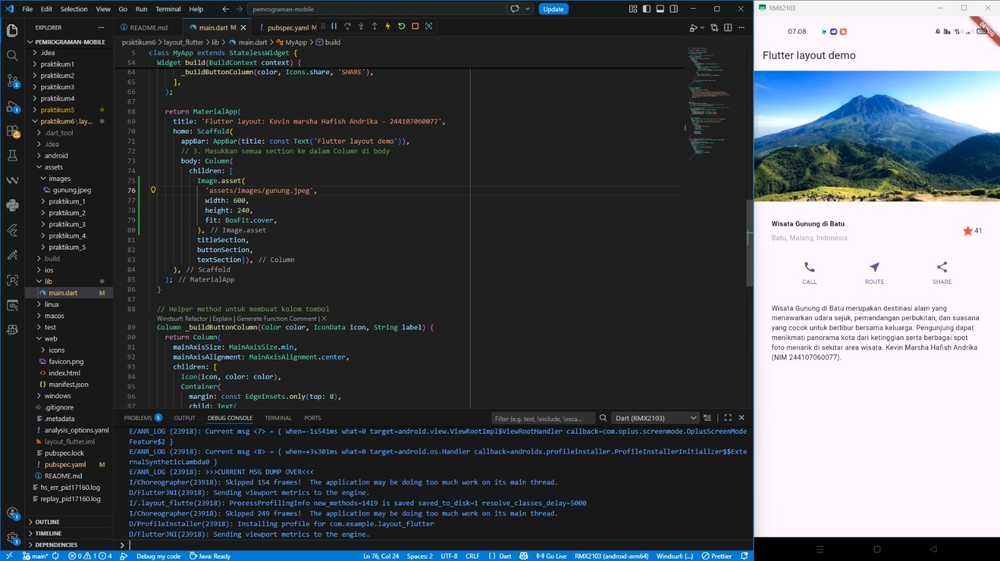
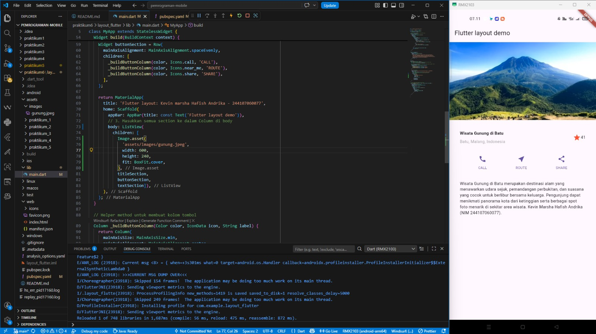
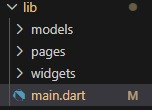
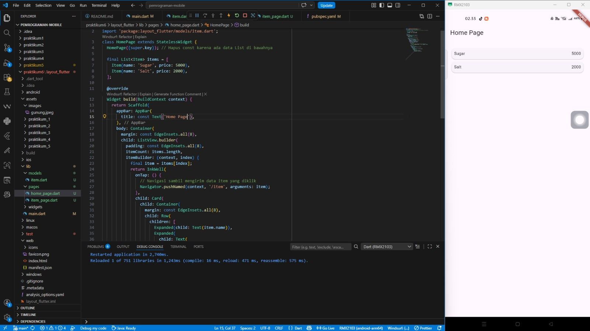
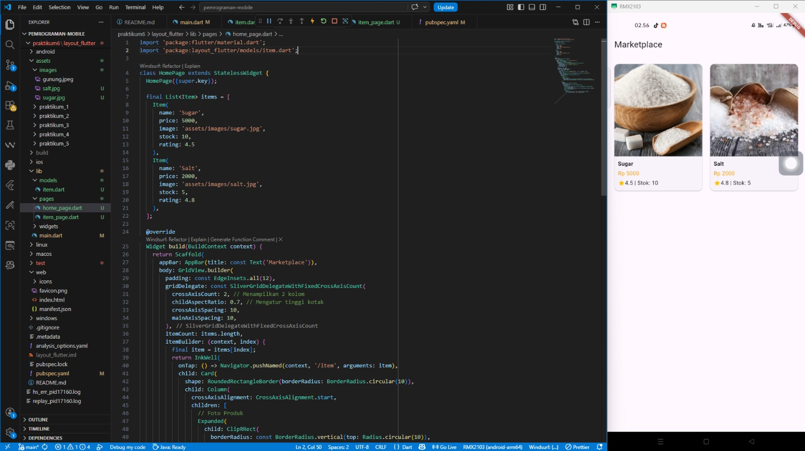
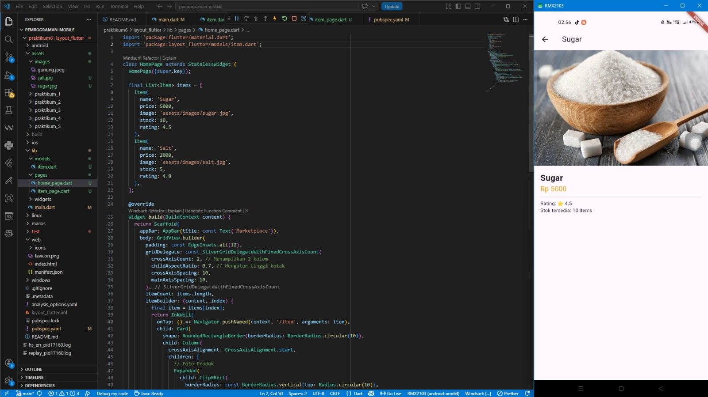

# Laporan Praktikum 06 - Layout dan Navigasi

**Nama** : Kevin Marsha Hafish Andrika  
**NIM**  : 244107060077  
**Absen**: 10 

---

## Praktikum 1: Membangun Layout di Flutter

### Langkah 1: Buat Project Baru
Buatlah sebuah project flutter baru dengan nama layout_flutter. Atau sesuaikan style laporan praktikum yang Anda buat.

### Langkah 2: Buka file lib/main.dart
Buka file main.dart lalu ganti dengan kode berikut. Isi nama dan NIM Anda di text title.



### Langkah 3: Identifikasi layout diagram
Langkah pertama adalah memecah tata letak menjadi elemen dasarnya:

* Identifikasi baris dan kolom.
* Apakah tata letaknya menyertakan kisi-kisi (grid)?
* Apakah ada elemen yang tumpang tindih?
* Apakah UI memerlukan tab?
* Perhatikan area yang memerlukan alignment, padding, atau borders.


### Langkah 4: Implementasi title row
Pertama, Anda akan membuat kolom bagian kiri pada judul. Tambahkan kode berikut di bagian atas metode build() di dalam kelas MyApp:




## Praktikum 2: Implementasi button row

### Langkah 1: Buat method Column _buildButtonColumn
Bagian tombol berisi 3 kolom yang menggunakan tata letak yang sama—sebuah ikon di atas baris teks. Kolom pada baris ini diberi jarak yang sama, dan teks serta ikon diberi warna primer.

Karena kode untuk membangun setiap kolom hampir sama, buatlah metode pembantu pribadi bernama buildButtonColumn(), yang mempunyai parameter warna, Icon dan Text, sehingga dapat mengembalikan kolom dengan widgetnya sesuai dengan warna tertentu.

**lib/main.dart (_buildButtonColumn)**
```dart
  Column _buildButtonColumn(Color color, IconData icon, String label) {
    return Column(
      mainAxisSize: MainAxisSize.min,
      mainAxisAlignment: MainAxisAlignment.center,
      children: [
        Icon(icon, color: color),
        Container(
          margin: const EdgeInsets.only(top: 8),
          child: Text(
            label,
            style: TextStyle(
              fontSize: 12,
              fontWeight: FontWeight.w400,
              color: color,
            ),
          ),
        ),
      ],
    );
  }
```

###Langkah 2: Buat widget buttonSection
Buat Fungsi untuk menambahkan ikon langsung ke kolom. Teks berada di dalam Container dengan margin hanya di bagian atas, yang memisahkan teks dari ikon.

Bangun baris yang berisi kolom-kolom ini dengan memanggil fungsi dan set warna, Icon, dan teks khusus melalui parameter ke kolom tersebut. Sejajarkan kolom di sepanjang sumbu utama menggunakan MainAxisAlignment.spaceEvenly untuk mengatur ruang kosong secara merata sebelum, di antara, dan setelah setiap kolom. Tambahkan kode berikut tepat di bawah deklarasi titleSection di dalam metode build():

**lib/main.dart (buttonSection)**
```dart
Color color = Theme.of(context).primaryColor;

Widget buttonSection = Row(
  mainAxisAlignment: MainAxisAlignment.spaceEvenly,
  children: [
    _buildButtonColumn(color, Icons.call, 'CALL'),
    _buildButtonColumn(color, Icons.near_me, 'ROUTE'),
    _buildButtonColumn(color, Icons.share, 'SHARE'),
  ],
);
```

untuk kode setelah di masukkan yaitu 

```dart
    import 'package:flutter/material.dart';

    void main() => runApp(const MyApp());

    class MyApp extends StatelessWidget {
    const MyApp({super.key});

    // Getter untuk titleSection tetap aman di sini
    Widget get titleSection {
        return Container(
        padding: const EdgeInsets.all(32.0),
        child: Row(
            children: [
            Expanded(
                child: Column(
                crossAxisAlignment: CrossAxisAlignment.start,
                children: [
                    Container(
                    padding: const EdgeInsets.only(bottom: 8.0),
                    child: const Text(
                        'Wisata Gunung di Batu',
                        style: TextStyle(
                        fontWeight: FontWeight.bold,
                        ),
                    ),
                    ),
                    Text(
                    'Batu, Malang, Indonesia',
                    style: TextStyle(
                        color: Colors.grey[500],
                    ),
                    ),
                ],
                ),
            ),
            const Icon(
                Icons.star,
                color: Colors.red,
            ),
            const Text('41'),
            ],
        ),
        );
    }

    @override
    Widget build(BuildContext context) {
        // 1. Definisikan warna di dalam method build agar context valid
        Color color = Theme.of(context).primaryColor;

        // 2. Definisikan buttonSection di dalam build karena butuh variabel 'color'
        Widget buttonSection = Row(
        mainAxisAlignment: MainAxisAlignment.spaceEvenly,
        children: [
            _buildButtonColumn(color, Icons.call, 'CALL'),
            _buildButtonColumn(color, Icons.near_me, 'ROUTE'),
            _buildButtonColumn(color, Icons.share, 'SHARE'),
        ],
        );

        return MaterialApp(
        title: 'Flutter layout: Kevin marsha Hafish Andrika - 244107060077',
        home: Scaffold(
            appBar: AppBar(title: const Text('Flutter layout demo')),
            // 3. Masukkan semua section ke dalam Column di body
            body: Column(
            children: [
                titleSection,
                buttonSection,
            ],
            ),
        ),
        );
    }

    // Helper method untuk membuat kolom tombol
    Column _buildButtonColumn(Color color, IconData icon, String label) {
        return Column(
        mainAxisSize: MainAxisSize.min,
        mainAxisAlignment: MainAxisAlignment.center,
        children: [
            Icon(icon, color: color),
            Container(
            margin: const EdgeInsets.only(top: 8),
            child: Text(
                label,
                style: TextStyle(
                fontSize: 12,
                fontWeight: FontWeight.w400,
                color: color,
                ),
            ),
            ),
        ],
        );
    }
    }
```

### Langkah 3: Tambah button section ke body
Tambahkan variabel buttonSection ke dalam body seperti berikut:




## Praktikum 3: Implementasi text section
### Langkah 1: Buat widget textSection
Tentukan bagian teks sebagai variabel. Masukkan teks ke dalam Container dan tambahkan padding di sepanjang setiap tepinya. Tambahkan kode berikut tepat di bawah deklarasi buttonSection:

```dart
  Widget get textSection {
    return Container(
      padding: const EdgeInsets.all(32),
      child: const Text(
        'Wisata Gunung di Batu merupakan destinasi alam yang menawarkan '
        'udara sejuk, pemandangan perbukitan, dan suasana yang cocok untuk '
        'berlibur bersama keluarga. Pengunjung dapat menikmati panorama kota '
        'dari ketinggian serta berbagai spot foto menarik di sekitar area wisata. '
        'Kevin Marsha Hafish Andrika (NIM 244107060077).',
        softWrap: true,
      ),
    );
  }
```

Dengan memberi nilai softWrap = true, baris teks akan memenuhi lebar kolom sebelum membungkusnya pada batas kata.

### Langkah 2: Tambahkan variabel text section ke body
Tambahkan widget variabel textSection ke dalam body seperti berikut:

```dart
    return MaterialApp(
      title: 'Flutter layout: Kevin marsha Hafish Andrika - 244107060077',
      home: Scaffold(
        appBar: AppBar(title: const Text('Flutter layout demo')),
        // 3. Masukkan semua section ke dalam Column di body
        body: Column(
          children: [
            titleSection, 
            buttonSection,
            textSection]),
      ),
    );
```




## Praktikum 4: Implementasi image section
### Langkah 1: Langkah 1: Siapkan aset gambar
Anda dapat mencari gambar di internet yang ingin ditampilkan. Buatlah folder images di root project layout_flutter. Masukkan file gambar tersebut ke folder images, lalu set nama file tersebut ke file pubspec.yaml seperti berikut:

```yaml
assets:
  - assets/images/gunung.jpeg
```

Contoh nama file gambar di atas adalah gunung.jpeg

### Langkah 2: Tambahkan gambar ke body
Tambahkan aset gambar ke dalam body seperti berikut:

```dart
    return MaterialApp(
      title: 'Flutter layout: Nama dan NIM Anda',
      home: Scaffold(
        appBar: AppBar(
          title: const Text('Flutter layout demo'),
        ),
        body: Column(
          children: [
            Image.asset(
              'assets/images/gunung.jpeg',
              width: 600,
              height: 240,
              fit: BoxFit.cover,
            ),
            titleSection,
            buttonSection,
            textSection,
          ],
        ),
      ),
    );
```



BoxFit.cover memberi tahu kerangka kerja bahwa gambar harus sekecil mungkin tetapi menutupi seluruh kotak rendernya.

### Langkah 3: Terakhir, ubah menjadi ListView
Pada langkah terakhir ini, atur semua elemen dalam ListView, bukan Column, karena ListView mendukung scroll yang dinamis saat aplikasi dijalankan pada perangkat yang resolusinya lebih kecil.
```dart
body: ListView(
          children: [
            Image.asset(
              'assets/images/gunung.jpeg',
              width: 600,
              height: 240,
              fit: BoxFit.cover,
            ),
            titleSection,
            buttonSection,
            textSection,
          ],
        ),
```



## Praktikum 5: Membangun Navigasi di Flutter
Selesaikan langkah-langkah praktikum berikut ini menggunakan editor Visual Studio Code (VS Code) atau Android Studio atau code editor lain kesukaan Anda. Materi ini dapat dimasukkan ke Laporan Praktikum folder Week atau Pertemuan 06.

Pada praktikum 5 ini anda akan belajar mengenai pembangunan aplikasi bergerak multi halaman. Aplikasi yang dikembangkan berupa kasus daftar barang belanja. Pada aplikasi ini anda akan belajar untuk berpindah halaman dan mengirimkan data ke halaman lainnya. Gambaran mockup hasil akhir aplikasi dapat anda lihat pada gambar di atas (mockup dibuat sederhana, sehingga Anda mempunyai banyak ruang untuk berkreasi). Desain aplikasi menampilkan sebuah ListView widget yang datanya bersumber dari List. Ketika item ditekan, data akan dikirimkan ke halaman berikutnya.

### Langkah 1: Siapkan project baru
Sebelum melanjutkan praktikum, buatlah sebuah project baru Flutter dengan nama belanja dan susunan folder seperti pada gambar berikut. Penyusunan ini dimaksudkan untuk mengorganisasi kode dan widget yang lebih mudah.




### Langkah 2: Mendefinisikan Route
Buatlah dua buah file dart dengan nama home_page.dart dan item_page.dart pada folder pages. Untuk masing-masing file, deklarasikan class HomePage pada file home_page.dart dan ItemPage pada item_page.dart. Turunkan class dari StatelessWidget. Gambaran potongan kode dapat anda lihat sebagai berikut.


### Langkah 3: Lengkapi Kode di main.dart
Setelah kedua halaman telah dibuat dan didefinisikan, bukalah file main.dart. Pada langkah ini anda akan mendefinisikan Route untuk kedua halaman tersebut. Definisi penamaan route harus bersifat unique. Halaman HomePage didefinisikan sebagai /. Dan halaman ItemPage didefinisikan sebagai /item. Untuk mendefinisikan halaman awal, anda dapat menggunakan named argument initialRoute. Gambaran tahapan ini, dapat anda lihat pada potongan kode berikut.


### Langkah 4: Membuat data model
Sebelum melakukan perpindahan halaman dari HomePage ke ItemPage, dibutuhkan proses pemodelan data. Pada desain mockup, dibutuhkan dua informasi yaitu nama dan harga. Untuk menangani hal ini, buatlah sebuah file dengan nama item.dart dan letakkan pada folder models. Pada file ini didefinisikan pemodelan data yang dibutuhkan. Ilustrasi kode yang dibutuhkan, dapat anda lihat pada potongan kode berikut.

```dart
class Item {
  String name;
  int price;

  Item({required this.name, required this.price});
}
```

### Langkah 5: Lengkapi kode di class HomePage
Pada halaman HomePage terdapat ListView widget. Sumber data ListView diambil dari model List dari object Item. Gambaran kode yang dibutuhkan untuk melakukan definisi model dapat anda lihat sebagai berikut.

```dart
class HomePage extends StatelessWidget {
  HomePage({super.key});

  final List<Item> items = [
    Item(name: 'Sugar', price: 5000),
    Item(name: 'Salt', price: 2000),
  ];
}
```

### Langkah 6: Membuat ListView dan itemBuilder
Untuk menampilkan ListView pada praktikum ini digunakan itemBuilder. Data diambil dari definisi model yang telah dibuat sebelumnya. Untuk menunjukkan batas data satu dan berikutnya digunakan widget Card. Kode yang telah umum pada bagian ini tidak ditampilkan. Gambaran kode yang dibutuhkan dapat anda lihat sebagai berikut.



### Langkah 7: Menambahkan aksi pada ListView
Item pada ListView saat ini ketika ditekan masih belum memberikan aksi tertentu. Untuk menambahkan aksi pada ListView dapat digunakan widget InkWell atau GestureDetector. Perbedaan utamanya InkWell merupakan material widget yang memberikan efek ketika ditekan. Sedangkan GestureDetector bersifat umum dan bisa juga digunakan untuk gesture lain selain sentuhan. Pada praktikum ini akan digunakan widget InkWell.

Untuk menambahkan sentuhan, letakkan cursor pada widget pembuka Card. Kemudian gunakan shortcut quick fix dari VSCode (Ctrl + . pada Windows atau Cmd + . pada MacOS). Sorot menu wrap with widget... Ubah nilai widget menjadi InkWell serta tambahkan named argument onTap yang berisi fungsi untuk berpindah ke halaman ItemPage. Ilustrasi potongan kode dapat anda lihat pada potongan berikut.

```dart
return InkWell(
              onTap: () {
                Navigator.pushNamed(
                  context,
                  '/item',
                );
              },
            );
```


## Tugas Praktikum 2
1. Untuk melakukan pengiriman data ke halaman berikutnya, cukup menambahkan informasi arguments pada penggunaan Navigator. Perbarui kode pada bagian Navigator menjadi seperti berikut.
```dart
Navigator.pushNamed(context, '/item', arguments: item);
```
2. Pembacaan nilai yang dikirimkan pada halaman sebelumnya dapat dilakukan menggunakan ModalRoute. Tambahkan kode berikut pada blok fungsi build dalam halaman ItemPage. Setelah nilai didapatkan, anda dapat menggunakannya seperti penggunaan variabel pada umumnya. (https://docs.flutter.dev/cookbook/navigation/navigate-with-arguments)
```dart
final itemArgs = ModalRoute.of(context)!.settings.arguments as Item;
```
3. Pada hasil akhir dari aplikasi belanja yang telah anda selesaikan, tambahkan atribut foto produk, stok, dan rating. Ubahlah tampilan menjadi GridView seperti di aplikasi marketplace pada umumnya.
4. Silakan implementasikan Hero widget pada aplikasi belanja Anda dengan mempelajari dari sumber ini: https://docs.flutter.dev/cookbook/navigation/hero-animations
6. Sesuaikan dan modifikasi tampilan sehingga menjadi aplikasi yang menarik. Selain itu, pecah widget menjadi kode yang lebih kecil. Tambahkan Nama dan NIM di footer aplikasi belanja Anda.
7. Selesaikan Praktikum 5: Navigasi dan Rute tersebut. Cobalah modifikasi menggunakan plugin go_router, lalu dokumentasikan dan push ke repository Anda berupa screenshot setiap hasil pekerjaan beserta penjelasannya di file README.md. Kumpulkan link commit repository GitHub Anda kepada dosen yang telah disepakati!

### Hasil



