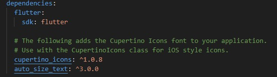
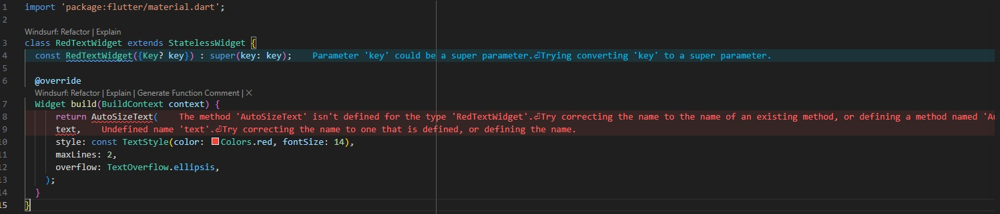
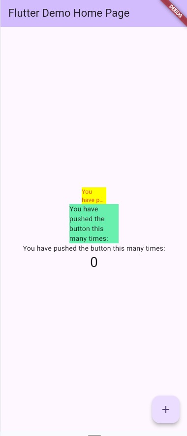

# Laporan Praktikum 06 - Layout dan Navigasi

**Nama** : Kevin Marsha Hafish Andrika  
**NIM**  : 244107060077  
**Absen**: 10 

---

1. Selesaikan Praktikum tersebut, lalu dokumentasikan dan push ke repository Anda berupa screenshot hasil pekerjaan beserta penjelasannya di file README.md!

JAWABAN 

### Langkah 1: Buat Project Baru
Buatlah sebuah project flutter baru dengan nama flutter_plugin_pubdev. Lalu jadikan repository di GitHub Anda dengan nama flutter_plugin_pubdev.

### Langkah 2: Menambahkan Plugin
Tambahkan plugin auto_size_text menggunakan perintah berikut di terminal
```dart
flutter pub add auto_size_text
```
Jika berhasil, maka akan tampil nama plugin beserta versinya di file pubspec.yaml pada bagian dependencies.



### Langkah 3: Buat file red_text_widget.dart
Buat file baru bernama red_text_widget.dart di dalam folder lib lalu isi kode seperti berikut.

```dart
import 'package:flutter/material.dart';

class RedTextWidget extends StatelessWidget {
  const RedTextWidget({Key? key}) : super(key: key);

  @override
  Widget build(BuildContext context) {
    return Container();
  }
}
```

### Langkah 4: Tambah Widget AutoSizeText
Masih di file red_text_widget.dart, untuk menggunakan plugin auto_size_text, ubahlah kode return Container() menjadi seperti berikut.

```dart
return AutoSizeText(
      text,
      style: const TextStyle(color: Colors.red, fontSize: 14),
      maxLines: 2,
      overflow: TextOverflow.ellipsis,
);
```

Setelah Anda menambahkan kode di atas, Anda akan mendapatkan info error. Mengapa demikian? Jelaskan dalam laporan praktikum Anda!



1. Variabel text Tidak Didefinisikan (Undefined Variable)
Pada baris return AutoSizeText(text, ...);, kamu mencoba memasukkan variabel bernama text. Namun, variabel text tersebut belum pernah dideklarasikan di dalam class RedTextWidget.
2. Widget AutoSizeText Membutuhkan Package Eksternal
AutoSizeText bukanlah widget bawaan (native) dari Flutter. Widget ini berasal dari package pihak ketiga. Jika kamu langsung menuliskan AutoSizeText tanpa menginstal packagenya terlebih dahulu, Flutter tidak akan mengenali widget tersebut.

### Langkah 5: Buat Variabel text dan parameter di constructor
Tambahkan variabel text dan parameter di constructor seperti berikut.

```dart
final String text;

const RedTextWidget({Key? key, required this.text}) : super(key: key);
```

### Langkah 6: Tambahkan widget di main.dart
Buka file main.dart lalu tambahkan di dalam children: pada class _MyHomePageState

```dart
Container(
   color: Colors.yellowAccent,
   width: 50,
   child: const RedTextWidget(
             text: 'You have pushed the button this many times:',
          ),
),
Container(
    color: Colors.greenAccent,
    width: 100,
    child: const Text(
           'You have pushed the button this many times:',
          ),
),
```

Run aplikasi tersebut dengan tekan F5, maka hasilnya akan seperti berikut.




2. Jelaskan maksud dari langkah 2 pada praktikum tersebut!

    Maksud dari langkah pada gambar tersebut adalah instruksi untuk menginstal library atau paket eksternal bernama auto_size_text ke dalam project Flutter.

    Secara bawaan, Flutter tidak memiliki fitur untuk mengecilkan ukuran teks secara otomatis jika ruangannya sempit. Oleh karena itu, kita perlu meminjam kode buatan orang lain (plugin/package) dari repositori resmi Flutter (pub.dev) agar fitur tersebut bisa digunakan.

3. Jelaskan maksud dari langkah 5 pada praktikum tersebut!

    Langkah pada tersebut adalah instruksi untuk membuat jembatan penerima data pada widget RedTextWidget.

    Langkah ini merupakan jawaban dan solusi langsung dari error pertama yang terjadi sebelumnya, yaitu ketika variabel text belum didefinisikan.

4. Pada langkah 6 terdapat dua widget yang ditambahkan, jelaskan fungsi dan perbedaannya!

    1. Container Pertama (Kuning, Lebar: 50)
    
          Fungsi: Menampilkan teks kustom buatanmu (RedTextWidget) di dalam kotak kuning dengan ruang horizontal yang sangat sempit, yaitu hanya 50 piksel.

          Perilaku Teks: Karena RedTextWidget menggunakan package AutoSizeText dengan aturan maxLines: 2, teks di dalamnya akan merespons secara cerdas. Teks akan mencoba memperkecil ukuran font-nya terlebih dahulu agar muat di lebar 50 piksel tersebut. Jika setelah dikecilkan masih tidak muat dalam 2 baris, sisa teksnya akan dipotong dan diganti dengan tanda titik-titik (... / ellipsis).

    2. Container Kedua (Hijau, Lebar: 100)
   
          Fungsi: Menampilkan widget Text bawaan standar Flutter di dalam kotak hijau dengan ruang horizontal selebar 100 piksel.

          Perilaku Teks: Berbeda dengan yang pertama, widget Text standar tidak bisa memperkecil ukuran font secara otomatis. Karena ukuran font-nya tetap, teks akan terus dipatahkan (wrap) ke baris baru di bawahnya sampai seluruh kalimat habis ditampilkan. Akibatnya, kotak hijau ini akan meregang jauh ke bawah secara vertikal.

5. Jelaskan maksud dari tiap parameter yang ada di dalam plugin auto_size_text berdasarkan tautan pada dokumentasi ini !

    Berdasarkan dokumentasi resmi dari plugin auto_size_text, parameter-parameter yang tersedia dirancang untuk memberikan kendali penuh terhadap bagaimana teks menyusut atau beradaptasi di dalam batas (constraints) kontainernya.

    Parameter Utama Pengatur Ukuran Otomatis

    - 'style' berfungsi sebagai Gaya teks standar. Properti fontSize di dalam style ini akan digunakan sebagai ukuran acuan awal (referensi) atau ukuran font maksimum standar sebelum teks mulai disesuaikan.
    - 'minFontSize' berfunsgi sebagai Batas ukuran font terkecil yang diizinkan saat teks menyusut. Jika teks sudah mencapai ukuran ini tapi masih tidak muat, teks akan dipotong mengikuti parameter overflow.
    - 'maxFontSize' berfungsi sebagai Batas ukuran font terbesar yang diizinkan. Teks tidak akan pernah melampaui ukuran ini meskipun ruang kontainernya sangat luas.
    - 'stepGranularity berfungsi sebagai Interval/langkah penurunan ukuran font. Dengan default 1.0, teks akan diturunkan ukurannya per 1 piksel (misal dari 16 ke 15, 14, dst.) sampai muat.
    - 'presetsFontSizes' berfungsi sebagai Daftar ukuran font spesifik yang kamu tentukan sendiri. (Catatan: Daftar ini harus diurutkan dari ukuran terbesar ke terkecil, misal: [28, 24, 20, 14]). Jika parameter ini diisi, maka minFontSize, maxFontSize, dan stepGranularity akan otomatis diabaikan.

    Parameter Pembatas & Penanganan Luapan (Overflow)

    - 'maxLines' berfungsi sebagai Batas maksimal jumlah baris yang diizinkan untuk teks tersebut.
    - 'overflow' berfungsi sebagai Menentukan visualisasi sisa teks yang meluap jika ukuran font sudah diperkecil hingga minFontSize dan jumlah baris sudah mencapai maxLines. Biasanya diisi dengan TextOverflow.ellipsis agar memunculkan tanda titik-titik (...).
    - 'overflowReplacement' berfungsi sebagai Widget pengganti alternatif. Jika teks benar-benar tidak muat di dalam kontainer meskipun sudah diperkecil hingga batas minimum, maka widget AutoSizeText akan disembunyikan dan digantikan sepenuhnya oleh widget yang ditaruh di parameter ini.

    Parameter Pengelompokan & Sinkronisasi

    - 'group' berfungsi sebagai Digunakan untuk mensinkronisasikan ukuran font pada beberapa widget AutoSizeText sekaligus. Misalnya kamu punya 3 kartu (card) dengan panjang judul berbeda-beda; dengan memasukkan objek AutoSizeGroup yang sama ke ketiganya, ukuran font ketiga judul tersebut akan menyusut secara seragam mengikuti teks yang paling panjang.